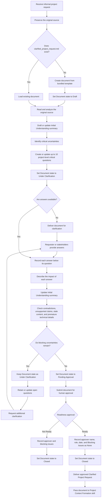

# Clarified Project Request Process Flow

Use this flow to explain or verify the process from receiving an informal project request to delivering an approved Clarified Project Request. The flowchart is a visual representation of the workflow defined in `SKILL.md`.

