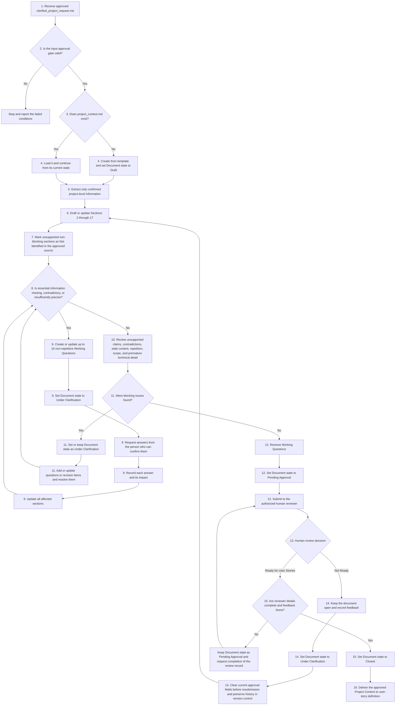

# Project Context Formation Flowchart

This flowchart is the exact visual mirror of the numbered workflow in `SKILL.md`.

```mermaid
flowchart TD
    A[1. Receive approved clarified_project_request.md] --> B{2. Is the input approval gate valid?}

    B -->|No| C[Stop and report the failed conditions]
    B -->|Yes| D{3. Does project_context.md exist?}

    D -->|No| E[4. Create from template and set Document state to Draft]
    D -->|Yes| F[4. Load it and continue from its current state]

    E --> G[5. Extract only confirmed project-level information]
    F --> G

    G --> H[6. Draft or update Sections 2 through 17]
    H --> I[7. Mark unsupported non-blocking sections as Not identified in the approved source]
    I --> J{8. Is essential information missing, contradictory, or insufficiently precise?}

    J -->|Yes| K[9. Create or update up to 10 non-repetitive Working Questions]
    K --> L[9. Set Document state to Under Clarification]
    L --> M[9. Request answers from the person who can confirm them]
    M --> N[9. Record each answer and its impact]
    N --> O[9. Update all affected sections]
    O --> J

    J -->|No| P[10. Review unsupported claims, contradictions, stale content, repetition, scope, and premature technical detail]
    P --> Q{11. Were blocking issues found?}

    Q -->|Yes| R[11. Set or keep Document state as Under Clarification]
    R --> S[11. Add or update questions or revision items and resolve them]
    S --> J

    Q -->|No| T[12. Remove Working Questions]
    T --> U[12. Set Document state to Pending Approval]
    U --> V[12. Submit to the authorized human reviewer]
    V --> W{13. Human review decision}

    W -->|Not Ready| X[14. Keep the document open and record feedback]
    X --> Y[14. Set Document state to Under Clarification]
    Y --> Z[14. Clear current approval fields before resubmission and preserve history in version control]
    Z --> H

    W -->|Ready for User Stories| AA{15. Are reviewer details complete and feedback None?}
    AA -->|No| AB[Keep Document state as Pending Approval and request completion of the review record]
    AB --> V
    AA -->|Yes| AC[15. Set Document state to Closed]
    AC --> AD[16. Deliver the approved Project Context to user-story definition]
```
