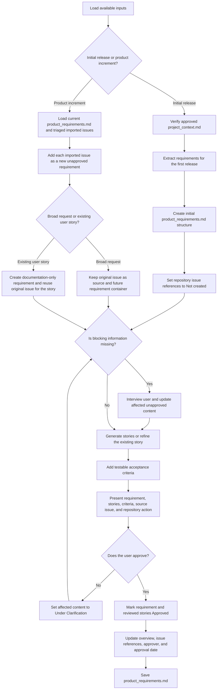

# Workflow

The workflow has two explicit entry branches. Both branches join only after the requirement and repository handling have been established.

## Written workflow

1. Load the available inputs.
2. Determine whether the mode is `initial release` or `product increment`.

### Initial release branch

3. Verify that `sdlc_docs/00_inception/project_context.md` is approved.
4. Extract the requirements for the first release.
5. Create the initial `product_requirements.md` structure.
6. Set all repository issue references to `Not created`.
7. Continue to the common refinement workflow at step 14.

### Product increment branch

8. Load the current `product_requirements.md` and only the imported repository issues that passed triage.
9. Process each imported issue as a new unapproved requirement; do not rewrite approved requirements.
10. Determine whether the original issue is a `broad-request` or an existing `user-story`.
11. For a `broad-request`, keep the original issue as the requirement source and future repository container; generate missing user stories later as new sub-issues.
12. For an existing `user-story`, create a documentation-only requirement, reuse the original issue for the story, and do not create a requirement issue or duplicate story issue.
13. Continue to the common refinement workflow at step 14.

### Common refinement and approval workflow

14. Determine whether blocking information is missing.
15. If information is missing, interview the user and update only the affected unapproved requirement or draft story.
16. Generate one or more user stories for a requirement, or refine the existing story when the source issue already represents one.
17. Add testable acceptance criteria to every story.
18. Present the requirement, stories, criteria, source issue, and intended repository action for review.
19. Determine whether the user approves the requirement and its stories.
20. If not approved, set the affected content to `Under Clarification` and repeat from step 14.
21. If approved, mark the requirement and reviewed stories `Approved`.
22. Update the overview table, issue references, approver, and approval date.
23. Save `sdlc_docs/01_requirements/product_requirements.md`.

## Flowchart

## Branch outcomes

### Initial release

The document produces approved requirements and stories first. Repository references remain `Not created` until the synchronization skill creates the corresponding issues.

### Product increment from a broad request

The original broad issue remains the requirement source and may later serve as the parent container. Newly generated stories are returned to the repository as new sub-issues.

### Product increment from an existing user story

The original issue remains the only repository issue for that story. The requirement exists only in the documentation, and the synchronization skill refines the original issue instead of creating a parent or duplicate issue.
