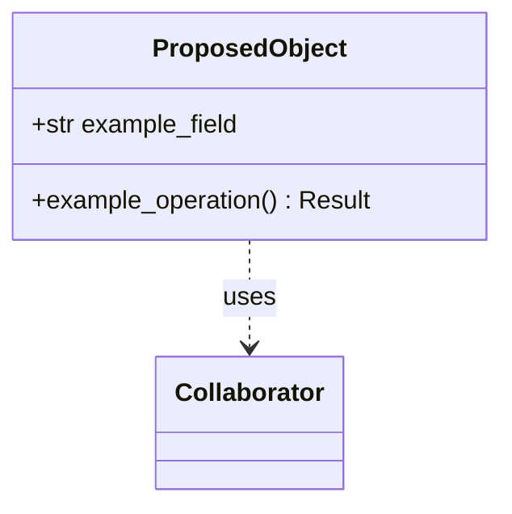
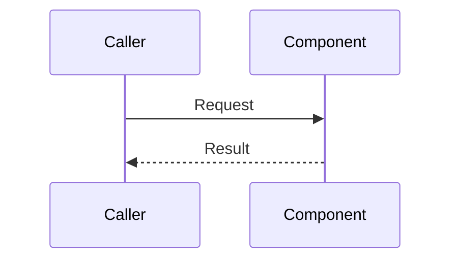
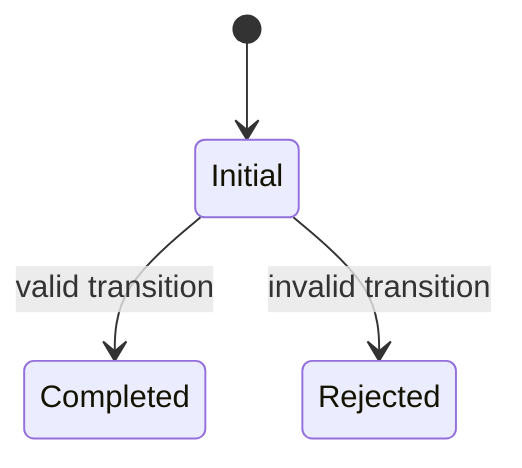
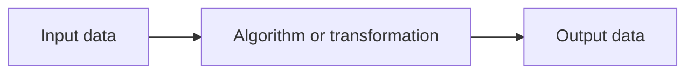

# Implementation Plan - <Issue Title>

<!-- implementation-plan | version: 1.0 | issue: 42 | story-version: 1.0 | architecture-version: 1.0 | repository-revision: <revision> -->

## Scope and Lineage

- Repository issue:
- Planning batch:
- Reconciliation batch, when applicable:
- Source stories:
- Technical review:
- Architecture document: `sdlc_docs/02_architecture/00_architecture_document.md`
- Relevant arc42 concerns:
- Software system:
- Container or data store:
- Component or data model:
- Runtime or deployment concern:
- Related architecture decisions:
- Mapping status:

## Coordination

- Suggested wave:
- Upstream dependencies:
- Downstream dependents:
- Parallel-safe with:
- Assignment notes:
- Kanban status:

## Architecture Constraints to Preserve

## Current Implementation Context

## Proposed Code-Level Design

## Code-Level UML Diagrams

Include standard UML diagrams in Mermaid syntax for non-trivial plans. If no UML diagram is needed, record the reason.

### UML Class Diagram

Use when the plan introduces or changes classes, dataclasses, DTOs, result objects, exceptions, services, helper APIs, schemas, or shared data structures.

### UML Sequence Diagram

Use when the plan changes runtime collaboration, validation gates, UI-to-service calls, export generation, or state handoffs.

### UML State Machine Diagram

Use when the plan changes workflow, session, lifecycle, validation, retry, or recovery states.

### Supplemental Non-UML Diagram, When Needed

Use only when UML is not the right notation, for example algorithm flow, data-flow sketches, or module-dependency sketches. Do not use this as a substitute for UML class, sequence, or state diagrams.

### Diagram Mapping

| Diagram | Notation | Architecture element | arc42 concern | Boundary check |
|---|---|---|---|---|

### Files and Structures

| Path | Action | Purpose | Architecture element | arc42 concern |
|---|---|---|---|---|

### Internal Design

### Interfaces and Data

### Configuration and Observability

## Implementation Increments

### Increment 1 - <Outcome>

- Architecture element:
- arc42 concern:
- Affected files:
- Developer tests:
- Implementation change:
- Verification:
- Dependencies:
- Completion condition:

## Data, Configuration, Migration, and Recovery

## Quality and Operational Verification

## Risks, Dependencies, and Open Questions

## Routes to Upstream Skills

## Readiness

- Assessment:
- Approver, when required:
- Date:
