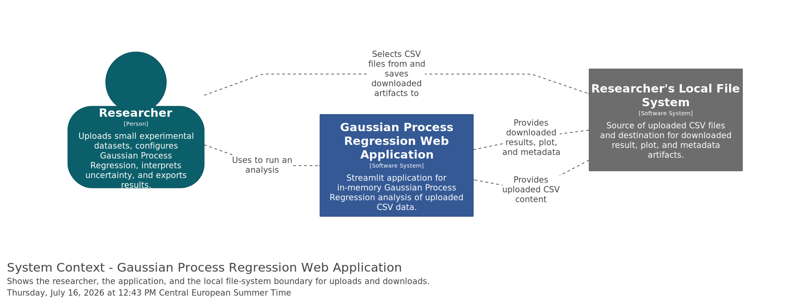
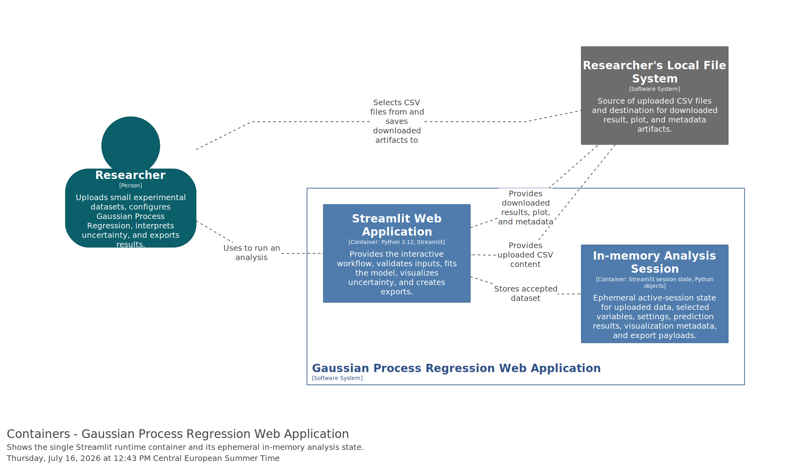
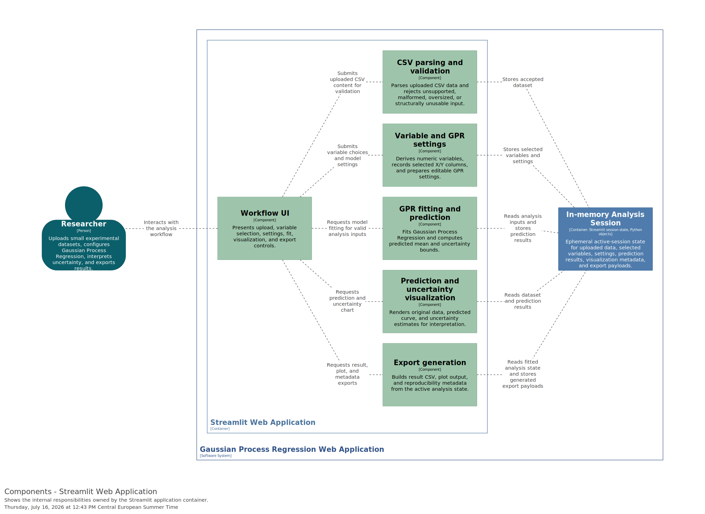
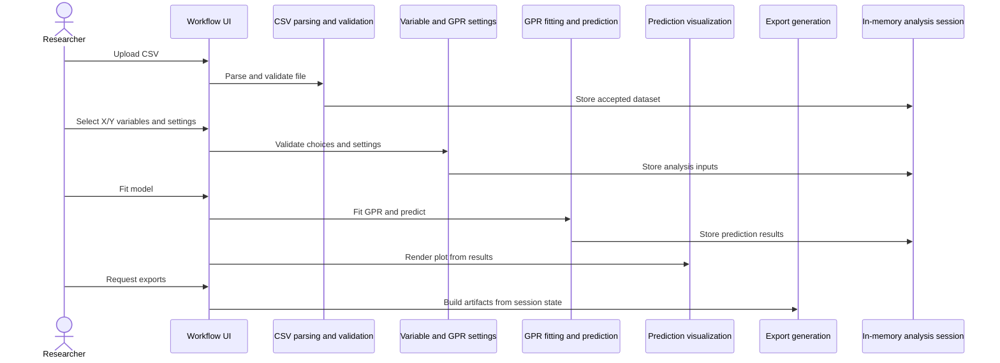
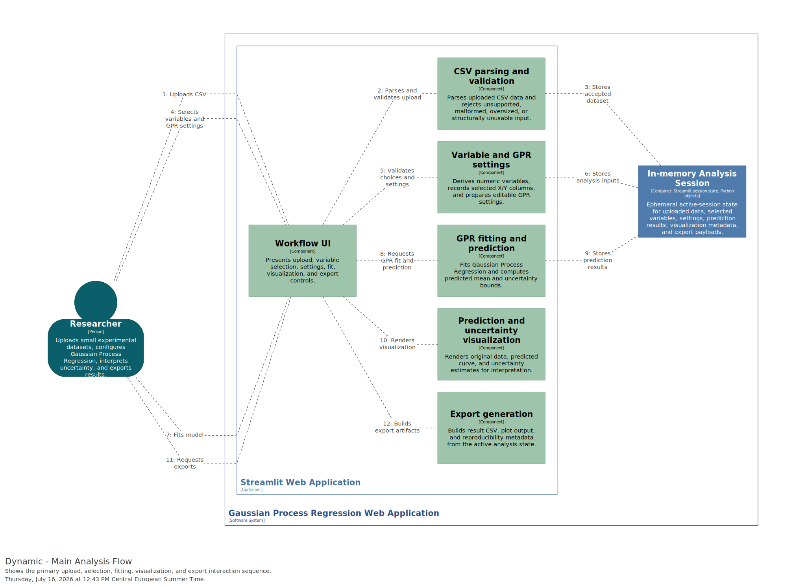
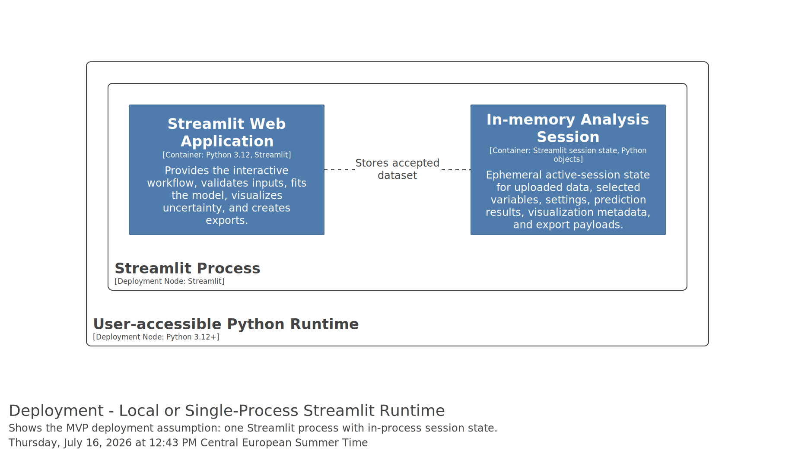

# Software Architecture

<!-- architecture | version: 1.0 | source-story-version: 1.0 | assessment: architecture-ready | decision: approved -->

## 1. Introduction and Goals

### 1.1 Purpose and Scope

This architecture covers the MVP Gaussian Process Regression web application described by user-story version `1.0`. The system lets researchers upload a CSV dataset, select numeric X and Y variables, configure Gaussian Process Regression settings, fit the model in memory, inspect prediction uncertainty, and export tabular and reproducibility materials.

The architecture is intentionally compact: a single Streamlit application owns the interactive workflow and delegates parsing, validation, model fitting, visualization, and export generation to modular internal components. Server-side persistence, user accounts, collaboration, batch processing, database storage, and deployment automation remain out of scope for this version.

This package migrates the previously approved legacy architecture overview into the current canonical arc42 and Structurizr layout. The semantic choices remain aligned with that legacy approval, and the migrated canonical package is approved for downstream technical-readiness review.

### 1.2 Stakeholders

| Stakeholder | Concern | Expected architecture information |
|---|---|---|
| Scientist / researcher | Complete an analysis without custom scripts and understand prediction uncertainty. | Clear workflow, validation behavior, model configuration, visualization, and export responsibilities. |
| Software engineers | Build and extend the app safely. | Container boundaries, component ownership, validation points, implementation mapping, quality tactics, and decisions. |
| End users | Receive understandable feedback and reproducible outputs. | Input constraints, error handling, and export content. |

### 1.3 Quality Goals

| Priority | Quality goal | Rationale | Validation scenario |
|---|---|---|---|
| 1 | Usability for researchers | The app exists to simplify exploratory GPR analysis. | A researcher can upload a supported CSV, select variables, fit the model, inspect uncertainty, and export results in one Streamlit session. |
| 2 | Scientific reproducibility | Exported outputs must support later review of the analysis. | A fitted analysis can produce prediction rows, selected variable names, model settings, plot output, and metadata sufficient to rerun the analysis. |
| 3 | Clear invalid-input handling | Researchers should not rely on invalid analyses. | Malformed CSV, unsupported or very large files, insufficient numeric columns, missing selected values, too few rows, and duplicate X values prevent progression with a clear message. |
| 4 | Modularity for extension | Future kernels, visualizations, or export formats should not require rewriting the UI workflow. | Parsing, validation, settings, fitting, plotting, and export behavior can be tested and changed through separate modules. |

## 2. Constraints

### 2.1 Technical Constraints

- The application shall be built with Streamlit.
- CSV upload is the input mechanism for MVP data intake.
- Uploaded datasets may contain multiple columns, but analysis uses two user-selected variables.
- Small experimental datasets are processed in memory for the active Streamlit session.
- The first version exposes kernel choice, length scale, noise level / alpha, prediction range, number of prediction points, and confidence interval level.
- No database or server-side saved-session store is in scope for version `1.0`.
- The repository currently uses Python `3.12+` with package root `src/gaussian_explorer`.

### 2.2 Organizational Constraints

- Architecture version `1.0` is bound to approved user-story version `1.0`.
- Product approval was recorded by Edwin Carreno on `2026-07-14`.
- Architecture decisions must not invent new product behavior beyond the approved stories and clarified handoff.

### 2.3 Conventions

- `diagrams/workspace.dsl` is the canonical C4 model.
- Generated diagram exports belong under `diagrams/images/` and are not edited manually.
- Implementation mappings use `confirmed` only when verified in the current repository; otherwise they use `proposed`.

## 3. Context and Scope

### 3.1 Business Context

The Gaussian Process Regression Web Application supports a researcher working with a local CSV file. The researcher uploads the file, makes analysis choices through the web UI, receives validation feedback, views the fitted prediction and uncertainty, and downloads analysis artifacts.

- C4 view key: `SystemContext`
- Canonical model: `diagrams/workspace.dsl`
- Exported image: `diagrams/images/SystemContext.svg`
- Export status: `exported`

External systems are limited to the researcher's local file system for uploads and downloads. No external identity provider, database, compute service, or collaboration platform is part of the MVP architecture.

### 3.2 Technical Context

| Interface | Direction | Format / protocol | Notes |
|---|---|---|---|
| CSV upload | Researcher to Streamlit app | Browser upload of CSV content | Must be validated before variable selection and fitting. |
| Interactive controls | Researcher to Streamlit app | Streamlit widgets | Used for variable selection, GPR settings, fit command, and export commands. |
| Visualization | Streamlit app to researcher | Interactive browser-rendered chart | Shows original data, predicted mean, and uncertainty bounds. |
| Export downloads | Streamlit app to researcher | Downloaded CSV, plot, and metadata artifacts | Generated from the active in-memory analysis state. |

The trust boundary is the uploaded file. Uploaded content is treated as untrusted data and must pass file-level and selected-data validation before model fitting.

## 4. Solution Strategy

- Use a single Streamlit web application as the only deployable runtime unit for the MVP.
- Keep dataset content, selected variables, settings, fitted prediction results, and export artifacts in Streamlit session memory.
- Separate the app into cohesive internal components: workflow UI, CSV parsing and validation, variable and settings preparation, GPR fitting and prediction, visualization, and export generation.
- Centralize invalid-input checks at workflow gates so unusable uploads cannot proceed to selection or fitting.
- Generate exports directly from the same active analysis state shown in the UI to keep visualization, tabular results, and reproducibility metadata aligned.
- Leave concrete GPR, plotting, and export-library choices to implementation planning while preserving component boundaries.

## 5. Building Block View

### 5.1 Software System

The software system is the "Gaussian Process Regression Web Application". It provides an interactive Streamlit experience for small in-memory GPR analyses.

### 5.2 Containers

| Container | Type | Responsibility | Technology | Detailed documentation |
|---|---|---|---|---|
| Streamlit Web Application | Web application | Owns the UI workflow, session state, validation gates, model-fitting orchestration, visualization, and downloads. | Python 3.12, Streamlit | Main document only for version `1.0`. |
| In-memory Analysis Session | Ephemeral runtime state | Holds uploaded dataset, selected variables, GPR settings, predictions, visualization state, and export artifacts for the active browser session. | Streamlit session state / Python objects | Main document only for version `1.0`; modeled as a store-like container because it owns active analysis state. |

- C4 view key: `Containers`
- Canonical model: `diagrams/workspace.dsl`
- Exported image: `diagrams/images/Containers.svg`
- Export status: `exported`

### 5.3 Significant Components and Data Models

| Owning container | Component or data model | Responsibility | Detailed documentation |
|---|---|---|---|
| Streamlit Web Application | Workflow UI | Presents upload, variable selection, settings, fit, visualization, and export controls. | Main document only. |
| Streamlit Web Application | CSV parsing and validation | Parses uploaded CSV data and rejects malformed, unsupported, oversized, or structurally unusable input. | Main document only. |
| Streamlit Web Application | Variable and GPR settings | Derives selectable numeric columns, records X/Y choices, and prepares editable model settings. | Main document only. |
| Streamlit Web Application | GPR fitting and prediction | Fits the Gaussian Process Regression model and computes prediction mean and uncertainty bounds. | Main document only. |
| Streamlit Web Application | Prediction and uncertainty visualization | Renders original data, predicted curve, and uncertainty estimates interactively. | Main document only. |
| Streamlit Web Application | Export generation | Produces results CSV, plot output, and reproducibility metadata from the fitted analysis state. | Main document only. |
| In-memory Analysis Session | Active analysis state | Ephemeral data model containing upload data, selected variables, settings, prediction arrays, visualization metadata, and generated export payloads. | Main document only. |

- C4 component view key: `StreamlitComponents`
- Canonical model: `diagrams/workspace.dsl`
- Exported image: `diagrams/images/StreamlitComponents.svg`
- Export status: `exported`

### 5.4 Selective Code-Level Design

The current repository confirms a CSV intake module at `src/gaussian_explorer/data.py`. The remaining module structure is proposed for implementation planning:

| Responsibility | Current or proposed implementation location | Mapping status |
|---|---|---|
| CSV upload parsing | `src/gaussian_explorer/data.py` | confirmed |
| Streamlit workflow entry point | `src/gaussian_explorer/app.py` or equivalent Streamlit entry module | proposed |
| Variable validation and selected-data validation | `src/gaussian_explorer/validation.py` | proposed |
| GPR settings and model fitting | `src/gaussian_explorer/model.py` | proposed |
| Prediction plotting | `src/gaussian_explorer/visualization.py` | proposed |
| Result and metadata export | `src/gaussian_explorer/export.py` | proposed |

## 6. Runtime View

### 6.1 Main Analysis Flow

### 6.2 Invalid-Input Flow

Validation happens at three workflow gates:

1. Upload validation rejects malformed CSV, unsupported file type, excessive file size, missing headers, and structurally unusable data.
2. Variable selection validation rejects datasets with no numeric columns or fewer than two selectable numeric columns.
3. Fitting validation rejects selected columns with missing values, too few rows, duplicate X values, or invalid model settings.

Each rejection prevents the downstream action and returns a user-facing explanation.

- C4 dynamic view key: `MainAnalysisFlow`
- Canonical model: `diagrams/workspace.dsl`
- Exported image: `diagrams/images/MainAnalysisFlow.svg`
- Export status: `exported`

## 7. Deployment View

The MVP deployment topology is intentionally simple and environment-neutral: one Streamlit process runs the web application and holds active analysis state in process memory for each session. Deployment automation is outside the approved story scope.

- C4 deployment view key: `LocalDeployment`
- Canonical model: `diagrams/workspace.dsl`
- Exported image: `diagrams/images/LocalDeployment.svg`
- Export status: `exported`

Operational implications:

- Restarting the Streamlit process clears active in-memory analysis state.
- Horizontal scaling is not part of the MVP because there is no shared session store.
- Production deployment choices, if later requested, must revisit state, file-size limits, resource limits, and observability.

## 8. Cross-Cutting Concepts

### 8.1 Security and Privacy

Uploaded files are untrusted inputs. The app should parse CSV content without executing uploaded content, enforce file size/type limits, and avoid server-side persistence of user data in MVP scope.

### 8.2 Data Management

The active dataset and model outputs are ephemeral. Reproducibility is supported through user-triggered exports containing selected variables, model settings, prediction outputs, plot output, and metadata rather than server-side saved analyses.

### 8.3 Configuration and Secrets

No application secrets are required by the approved MVP. GPR settings are user-editable analysis parameters, not deployment configuration.

### 8.4 Error Handling and Recovery

Invalid inputs are rejected at explicit workflow gates with corrective messages. Model-fitting failures should be caught and displayed without corrupting the previous valid session state.

### 8.5 Logging, Monitoring, and Observability

MVP observability is limited to local application logs and test feedback. Production monitoring is an open follow-up if a deployment target is later approved.

### 8.6 Performance and Scalability

The small-dataset assumption permits in-memory processing. File-size limits and row-count validation protect the Streamlit process from excessive memory or compute use.

### 8.7 Testing Strategy

Tests should cover CSV parsing, numeric-column detection, selected-data validation, GPR settings, fitting output shape, uncertainty calculations, export content, and the required invalid-input cases. UI-level tests or Streamlit integration checks should verify that workflow gates prevent invalid progression.

### 8.8 Additional Concepts

Accessibility and exact UI layout are downstream design concerns. The architecture requires clear feedback and a coherent workflow but does not prescribe widget placement.

## 9. Architecture Decisions

| Decision | Status | Related stories | Record |
|---|---|---|---|
| Use a single Streamlit application with in-memory session state for the MVP | accepted | US-0001, US-0002, US-0003, US-0004, US-0005, US-0006, US-0007, US-0008 | [architecture-decision-001-streamlit-in-memory-mvp.md](decisions/architecture-decision-001-streamlit-in-memory-mvp.md) |
| Separate the analysis workflow into modular internal components and export from active analysis state | accepted | US-0001, US-0002, US-0003, US-0004, US-0005, US-0006, US-0007, US-0008 | [architecture-decision-002-modular-analysis-pipeline.md](decisions/architecture-decision-002-modular-analysis-pipeline.md) |

## 10. Quality Requirements

### 10.1 Quality Scenario Summary

| ID | Stimulus and context | Expected response | Measure | Related architecture elements |
|---|---|---|---|---|
| QS-001 | A researcher uploads a supported multi-column CSV with at least two numeric columns. | The dataset is accepted and numeric columns become available for X/Y selection. | Selection can proceed without manual preprocessing. | Workflow UI, CSV parsing and validation, In-memory Analysis Session. |
| QS-002 | A researcher uploads malformed, unsupported, or excessively large input. | The app prevents analysis and explains the input problem. | No model fitting path is reachable from rejected input. | CSV parsing and validation, Workflow UI. |
| QS-003 | A researcher fits a model with valid selected variables and settings. | Prediction mean and uncertainty bounds are available for visualization and export. | Output arrays align to configured prediction points. | Variable and GPR settings, GPR fitting and prediction, Active analysis state. |
| QS-004 | A researcher exports results after fitting. | Results CSV and reproducibility artifacts include selected variables, settings, prediction values, uncertainty bounds, and plot/metadata material. | Export content can be traced to the active fitted session state. | Export generation, Prediction visualization, In-memory Analysis Session. |

### 10.2 Quality Evaluation Notes

The architecture is ready for implementation planning because each quality scenario has an owning component and explicit workflow gate. Automated diagram export has not been performed, so rendered C4 image quality remains unvalidated.

## 11. Risks and Technical Debt

| Risk or debt | Impact | Likelihood | Mitigation or follow-up | Owner |
|---|---|---|---|---|
| Concrete GPR and plotting libraries are not finalized in the architecture. | Implementation planning must choose compatible packages and test numerical behavior. | Medium | Select packages during implementation planning and record additional ADRs only if the choice has long-lived consequences. | Software engineers |
| In-memory state does not survive process restart or support multi-instance scaling. | Active analyses are lost on restart and horizontal scaling is constrained. | Medium | Accept for MVP; revisit if deployment, persistence, or collaboration enters scope. | Product and engineering |
| Exported diagram readability has not been manually inspected in this document. | A diagram could contain clipped labels or layout issues despite existing as SVG. | Low | Inspect exported SVGs when preparing the documentation package for publication. | Software engineers |
| File-size and row-count thresholds are not yet specified. | Implementation may choose limits inconsistently. | Medium | Define limits during implementation planning based on target runtime resources. | Software engineers |

## 12. Glossary

| Term | Meaning |
|---|---|
| CSV | Comma-Separated Values file used for tabular data. |
| Gaussian Process Regression (GPR) | Probabilistic regression technique that predicts a function with uncertainty estimates. |
| In-memory analysis session | Ephemeral Streamlit session state for uploaded data, selections, settings, predictions, and exports. |
| Prediction mean | The fitted model's expected output value at each prediction X value. |
| Uncertainty bounds | User-visible interval estimates derived from GPR uncertainty for the predicted curve. |

## Diagram Export Summary

| View key | View type | Image path | Format | Export status | Architecture version | Last verified |
|---|---|---|---|---|---|---|
| SystemContext | System Context | `diagrams/images/SystemContext.svg` | SVG | exported | 1.0 | 2026-07-16 |
| Containers | Container | `diagrams/images/Containers.svg` | SVG | exported | 1.0 | 2026-07-16 |
| StreamlitComponents | Component | `diagrams/images/StreamlitComponents.svg` | SVG | exported | 1.0 | 2026-07-16 |
| MainAnalysisFlow | Dynamic | `diagrams/images/MainAnalysisFlow.svg` | SVG | exported | 1.0 | 2026-07-16 |
| LocalDeployment | Deployment | `diagrams/images/LocalDeployment.svg` | SVG | exported | 1.0 | 2026-07-16 |

## Architecture Validation

- Structurizr rendering: `validated`; `docker compose -f sdlc_docs/02_architecture/diagrams/docker-compose.yml restart` loaded the corrected workspace without fresh parser errors on `2026-07-16`.
- Docker Compose validation: `validated` with `docker compose -f sdlc_docs/02_architecture/diagrams/docker-compose.yml config` on `2026-07-16`.
- Diagram export validation: `validated-present`; exported SVG files exist for all selected C4 views on `2026-07-16`.
- Markdown image-link validation: `validated`; no missing exported C4 image is embedded in this document.
- Traceability validation: `validated`; every active story in story version `1.0` has an architecture mapping.
- Link validation: `validated` for local decision and traceability links by repository file inspection.
- Known validation gaps: exported diagram readability has not been manually inspected in this document.

## Architecture Version and Approval

- Architecture version: `1.0`
- Source story version: `1.0`
- Assessment: `architecture-ready`
- Decision: `approved`
- Approver: `Edwin Carreno`
- Date: `2026-07-16`
- Approval history: Legacy `00_architecture_overview.md` in repository history recorded Edwin Carreno approval on `2026-07-14`; the migrated canonical package was approved on `2026-07-16`.
- Accepted risks: in-memory MVP state, no server-side persistence, no deployment automation, and no generated C4 image exports yet.
- Diagram export status: `exported`
