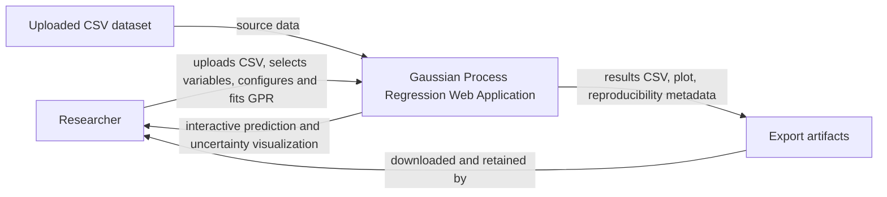
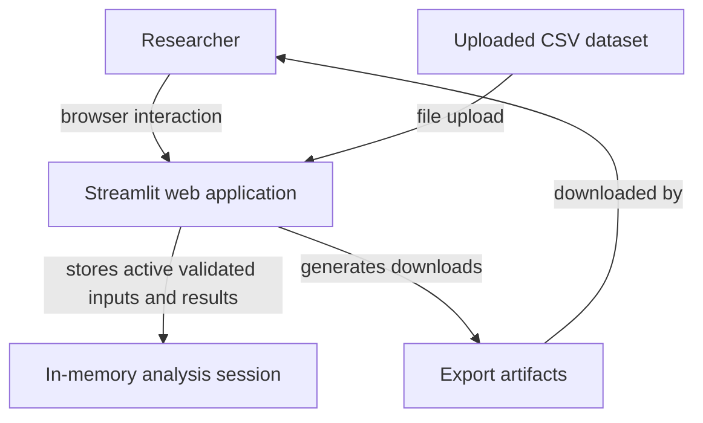
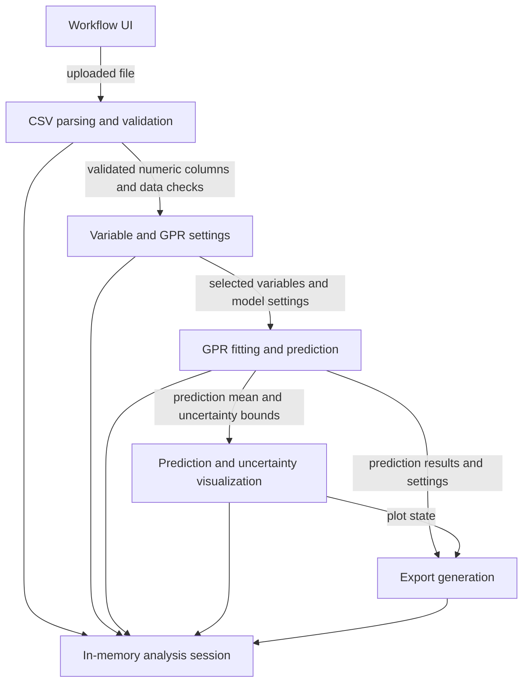
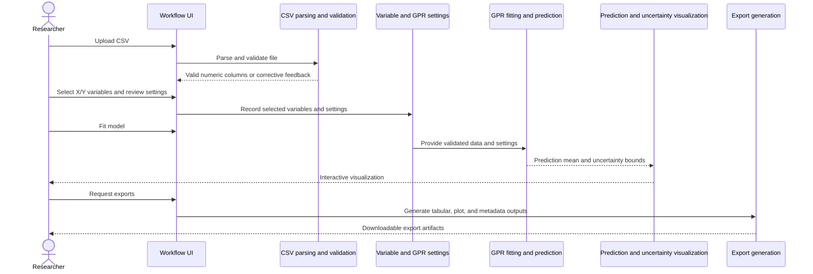
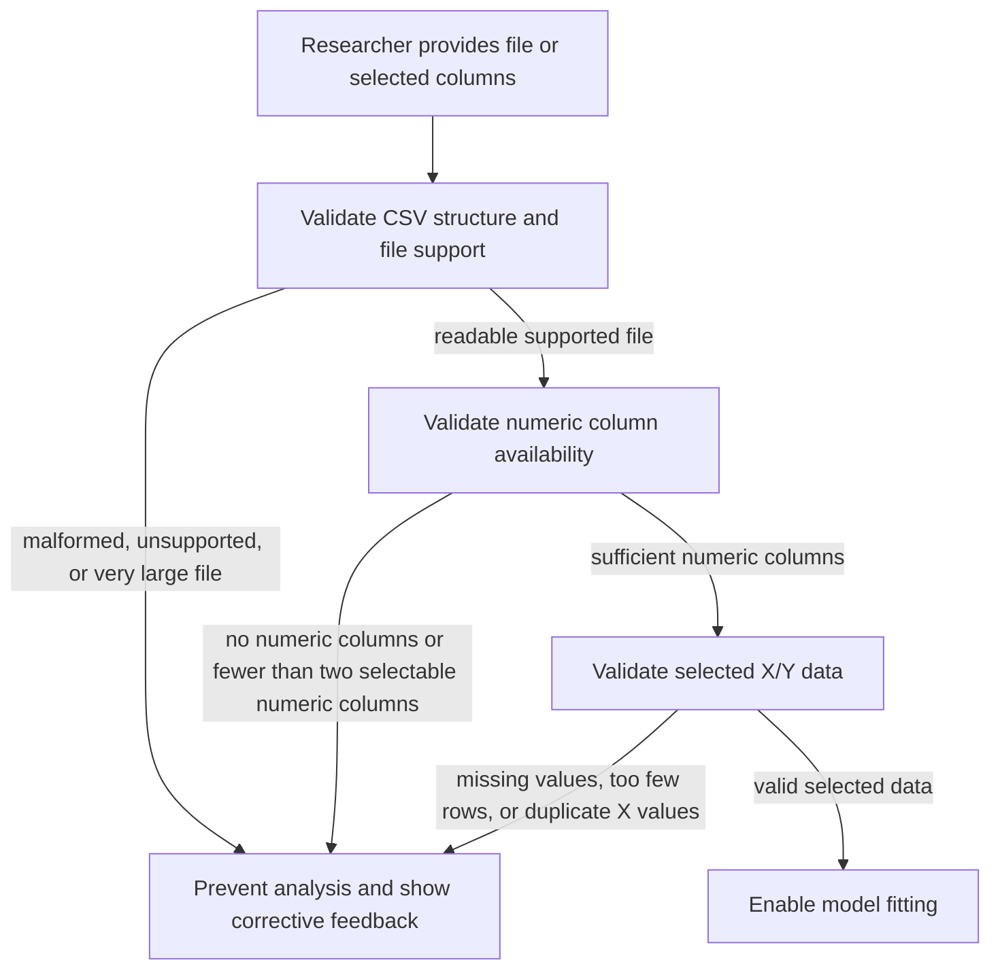

# Architecture and Design

## Current Architecture State

- Architecture version: `1.0`
- Source story version: `1.0`
- Product approval: `Verified`
- Assessment: `Architecture ready`
- Human decision: `Approved`
- Last updated: `2026-07-14`

<!-- architecture-state | architecture-version: 1.0 | source-story-version: 1.0 | assessment: architecture-ready | decision: approved -->

## Scope and Sources

- System of interest: Gaussian Process Regression Web Application.
- Included scope: Streamlit web interface, CSV upload, numeric variable selection, GPR configuration, model fitting, interactive prediction and uncertainty visualization, tabular export, plot export, reproducibility metadata, and invalid-input feedback.
- Excluded scope: user accounts, server-side persistence of past analyses, collaborative workflows, database storage, batch processing, deployment automation, and implementation-level class or module design.
- Source story IDs: `US-0001`, `US-0002`, `US-0003`, `US-0004`, `US-0005`, `US-0006`, `US-0007`, `US-0008`.
- Source batches: `PRDB-001`.
- Existing-state evidence: approved project context version `1.0`; approved user-story version `1.0`; approved product-readiness review for story version `1.0`; placeholder architecture files without validated architecture version binding.

## Architecture Drivers

### Confirmed Drivers

- Researchers need an end-to-end web workflow for CSV upload, variable selection, GPR fitting, visualization, and export.
- The application shall be built with Streamlit.
- CSV files may contain multiple columns; the researcher selects one numeric X column and one numeric Y column.
- First-version configurable GPR settings are kernel choice, length scale, noise level / alpha, prediction range, number of prediction points, and confidence interval level.
- The application must show original data, predicted curve, and uncertainty estimates.
- Exports include tabular prediction results, plot output, and reproducibility metadata.
- Invalid-input handling must cover malformed CSV, no numeric columns, fewer than two selectable numeric columns, missing values in selected columns, too few rows, duplicate X values, and unsupported or very large files.
- The design should remain modular enough to support future extension.

### Constraints and Quality Attributes

- CSV upload is the supported data intake mechanism for architecture version `1.0`.
- Small experimental datasets are processed in memory.
- User-visible validation must block invalid analysis and provide corrective feedback.
- Reproducibility is provided through exported settings, selected variables, prediction results, and plot metadata, not server-side saved sessions.
- The architecture must avoid adding persistence, accounts, collaboration, or batch behavior that is outside approved product scope.

### Technical Proposals

- Use a single Streamlit web application as the only independently running application in the first architecture version.
- Keep active analysis state in memory and generate export files on demand.
- Organize the Streamlit application around user-facing responsibilities: workflow UI, CSV validation, analysis configuration, GPR analysis, result visualization, and export generation.

### Assumptions, Risks, and Open Questions

- Architecture assumption: a single Streamlit application is sufficient because no approved story requires multiple services or persistent server-side history.
- Architecture assumption: datasets remain small enough for in-memory processing, consistent with `PRDB-001`.
- Risk: validation gaps could allow misleading model output; validation is therefore part of the main architecture path, not a secondary concern.
- Risk: reproducibility materials could drift from the fitted analysis if exports do not use the same analysis state as the visualization.
- Open questions: None blocking architecture version `1.0`.

## Existing-State Summary

The repository contained architecture folder placeholders and an old decision-template directory, but no current architecture overview, story map, component document, architecture decision records, version marker, or approval history. Architecture version `1.0` is therefore a create run.

## Target Architecture Summary

The target architecture is a single Streamlit web application used directly by researchers. It receives a CSV file, validates file and selected-data conditions, lets the researcher select variables and configure GPR settings, fits the model, shows prediction uncertainty, and generates export artifacts. All analysis state is limited to the active in-memory session for version `1.0`.

## System Context

## Containers and Major Responsibilities

| Name | Type | Responsibility | Owner | Status |
|---|---|---|---|---|
| Researcher | Person | Uploads data, selects variables and settings, fits GPR, interprets outputs, and exports results. | End user | active |
| Gaussian Process Regression Web Application | Software system | Provides the approved GPR analysis workflow. | Software engineers | active |
| Streamlit web application | Independently running web application | Hosts the interactive UI, validation, analysis orchestration, visualization, and export generation. | Software engineers | active |
| Uploaded CSV dataset | User-provided dataset | Supplies tabular source data for a single analysis workflow. | Researcher | active |
| In-memory analysis session | Runtime data | Holds validated data, selected variables, model settings, fitted results, visualization state, and export metadata for the active session. | Streamlit web application | active |
| Export artifacts | Generated files | Provide downloadable tabular results, plot, and reproducibility metadata. | Streamlit web application until download; researcher after download | active |

## Selected Architecture Views

### Container View

### Component View: Streamlit Web Application

### Primary Analysis Workflow

### Validation Failure Path

## Data Ownership and Lifecycle

| Data | Owner | Created By | Used By | Lifecycle | Notes |
|---|---|---|---|---|---|
| Uploaded CSV dataset | Researcher | Researcher upload | CSV parsing and validation; Variable and GPR settings; GPR fitting and prediction | Active analysis workflow only unless retained by the researcher outside the app. | May contain multiple columns; only selected numeric X/Y columns are analyzed. |
| In-memory analysis session | Streamlit web application | Streamlit web application | All Streamlit application components | Active session state for one analysis workflow. | No server-side persistence is in scope. |
| Export artifacts | Researcher after download | Export generation | Researcher | Generated on demand after successful fitting. | Includes results CSV, plot, and reproducibility metadata. |

## Interfaces and External Contracts

| Interface | Provider | Consumer | Purpose | Mechanism | Material Failure Behavior |
|---|---|---|---|---|---|
| CSV upload | Workflow UI | Researcher; CSV parsing and validation | Accept a researcher-provided CSV dataset. | Streamlit file upload. | Reject malformed, unsupported, or very large files with corrective feedback. |
| Variable selection | Variable and GPR settings | Researcher; GPR fitting and prediction | Select numeric X and Y variables. | Streamlit selection controls backed by validated numeric columns. | Block fitting when numeric column requirements or selected-data validation fail. |
| GPR settings | Variable and GPR settings | Researcher; GPR fitting and prediction | Capture default or modified GPR settings. | Streamlit controls for confirmed settings. | Invalid settings are not used for fitting and are surfaced as user feedback. |
| Model fitting | GPR fitting and prediction | Workflow UI; Prediction and uncertainty visualization; Export generation | Produce GPR predictions and uncertainty bounds. | In-process application interaction. | Fitting is unavailable until validation succeeds; analysis errors are shown as feedback. |
| Results visualization | Prediction and uncertainty visualization | Researcher | Present original data, predicted curve, and uncertainty estimates. | Interactive Streamlit visualization. | Visualization waits for successful fitting. |
| Export download | Export generation | Researcher | Provide results CSV, plot, and reproducibility metadata. | Streamlit download interaction. | Export is unavailable until fitted results and required metadata exist. |

## Deployment and Operations

- Deployment context: one Streamlit web application runtime serving browser sessions.
- Runtime state: in-memory session state for architecture version `1.0`.
- External systems: none required by the approved scope.
- Operational support: validation protects the single application runtime from unsupported or very large files.
- Recovery behavior: researchers can reproduce later from exported results and metadata; server-side saved sessions are outside scope.

## Security and Trust Boundaries

- Trust boundary: researcher-provided CSV files enter the application through CSV upload.
- The application validates file structure, numeric columns, selected data, and file support before fitting.
- No user accounts, authentication, database storage, or collaborative access control is introduced in architecture version `1.0`.
- Export artifacts are generated for the current workflow and become researcher-owned after download.

## Component Documents

| Component or Application | Document | Purpose |
|---|---|---|
| Streamlit web application | [components/streamlit-application/architecture.md](components/streamlit-application/architecture.md) | Defines internal responsibilities and interfaces for the Streamlit web application. |

## Architecture Decisions

| Decision Record | Status | Decision | Related Architecture Areas |
|---|---|---|---|
| [architecture-decision-001-single-streamlit-web-application.md](decisions/architecture-decision-001-single-streamlit-web-application.md) | accepted | Use one Streamlit web application for architecture version `1.0`. | System context, Container view, Streamlit web application |
| [architecture-decision-002-in-memory-session-and-export-reproducibility.md](decisions/architecture-decision-002-in-memory-session-and-export-reproducibility.md) | accepted | Use in-memory session state and export artifacts for reproducibility. | Data ownership, Export generation, In-memory analysis session |

## Architecture Validation

- Product approval verified: `Yes`
- Story mapping complete: `Yes`
- Blocking architecture questions: `None`
- Mermaid syntax validation: `Not performed; no local Mermaid CLI was available.`
- Technical-readiness review may proceed: `Yes`

## Decision History

| Architecture Version | Source Story Version | Date | Actor | Action | Assessment | Notes |
|---|---|---|---|---|---|---|
| 1.0 | 1.0 | 2026-07-14 | ChatGPT | Generated | architecture-ready | Initial architecture package generated from approved story version 1.0; architecture approval pending. |
| 1.0 | 1.0 | 2026-07-14 | Edwin Carreno | Approved | architecture-ready | Approved for technical-readiness review. |
