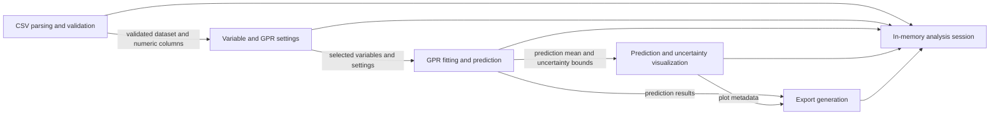

# Component Architecture: Streamlit Web Application

- Component name: `Streamlit web application`
- Introduced architecture version: `1.0`
- Last revised architecture version: `1.0`
- Last revised source story version: `1.0`
- Lifecycle: `active`

<!-- architecture-component | component-name: Streamlit web application | introduced-version: 1.0 | last-revised-version: 1.0 | source-story-version: 1.0 | lifecycle: active -->

## Purpose

The Streamlit web application provides the complete approved GPR analysis workflow: upload, validation, variable selection, model configuration, fitting, visualization, and export.

## Responsibilities and Boundaries

- Own the browser-based workflow used by researchers.
- Validate uploaded files and selected data before model fitting.
- Maintain active analysis state in memory.
- Fit GPR from validated selected variables and supported settings.
- Display original data, predicted curve, and uncertainty estimates.
- Generate tabular results, plot export, and reproducibility metadata.
- Exclude server-side persistence, user accounts, collaboration, database storage, batch processing, and deployment automation.

## Related User Stories

`US-0001`, `US-0002`, `US-0003`, `US-0004`, `US-0005`, `US-0006`, `US-0007`, `US-0008`

## Internal Components

| Component | Responsibility |
|---|---|
| Workflow UI | Presents upload, selection, settings, fitting, visualization, export, and error-feedback interactions. |
| CSV parsing and validation | Parses uploaded CSV data and validates file support, numeric column availability, selected column data, missing values, too few rows, duplicate X values, and large-file constraints. |
| Variable and GPR settings | Captures selected X/Y variables and supported first-version GPR settings. |
| GPR fitting and prediction | Fits the GPR model and produces predicted X values, predicted mean, and uncertainty bounds from validated inputs. |
| Prediction and uncertainty visualization | Displays original data, predicted curve, and uncertainty estimates in an interactive visualization. |
| Export generation | Generates results CSV, plot export, and reproducibility metadata from fitted analysis state. |

## Interfaces

| Interface | Provider | Consumer | Purpose | Mechanism | Material Failure Behavior |
|---|---|---|---|---|---|
| CSV upload | Workflow UI | Researcher; CSV parsing and validation | Accept researcher-provided CSV input. | Streamlit file upload. | Reject malformed, unsupported, or very large files with corrective feedback. |
| Variable selection | Variable and GPR settings | Researcher; GPR fitting and prediction | Select numeric X and Y variables. | Streamlit selection controls. | Block fitting when numeric column or selected-data requirements fail. |
| GPR settings | Variable and GPR settings | Researcher; GPR fitting and prediction | Configure supported GPR settings. | Streamlit controls. | Invalid settings are not used for fitting and are surfaced to the user. |
| Model fitting | GPR fitting and prediction | Workflow UI; Prediction and uncertainty visualization; Export generation | Produce GPR predictions and uncertainty bounds. | In-process application interaction. | Fitting is unavailable until validation succeeds; fitting failures are reported as feedback. |
| Results visualization | Prediction and uncertainty visualization | Researcher | Show original data, prediction, and uncertainty. | Interactive Streamlit visualization. | Visualization waits for fitted prediction results. |
| Export download | Export generation | Researcher | Provide downloadable results, plot, and metadata. | Streamlit download interaction. | Export waits for fitted results and reproducibility metadata. |

## Data Received, Produced, and Owned

- Receives the uploaded CSV dataset from the researcher.
- Owns the in-memory analysis session during the active workflow.
- Produces export artifacts on demand after successful fitting.

## Critical Workflows and Diagrams

## Quality, Security, and Operational Concerns

- Validation is mandatory before model fitting so researchers do not rely on invalid analyses.
- Large-file rejection protects the in-memory runtime.
- Export generation uses fitted analysis state to reduce reproducibility drift.
- No persistent account, credential, or database boundary is introduced in architecture version `1.0`.

## Dependencies

- Streamlit is a confirmed product constraint.
- A Python-compatible Gaussian Process Regression capability will be selected during downstream implementation planning within this architecture boundary.

## Decisions and Architecture Records

- architecture-decision-001: Single Streamlit web application.
- architecture-decision-002: In-memory session and export reproducibility.

## Assumptions, Risks, and Open Questions

- Architecture assumption: one Streamlit web application is sufficient for the approved first workflow.
- Risk: very large files can exceed in-memory expectations; upload validation must reject unsupported or very large files.
- Open questions: None blocking architecture version `1.0`.
