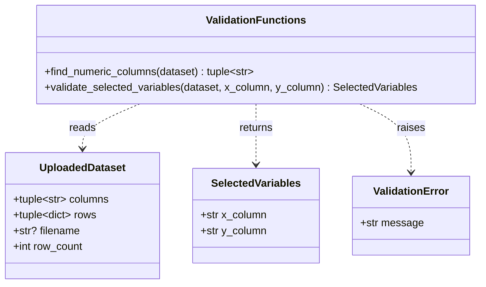
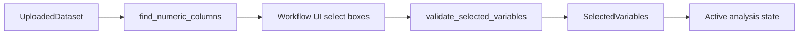

# Implementation Plan - Select Regression Variables

<!-- implementation-plan | version: 1.0 | issue: 10 | story-version: 1.0 | architecture-version: 1.0 | repository-revision: 2fb7e5d -->

## Scope and Lineage

- Repository issue: `#10` - `US-0002 - Select Regression Variables`
- Planning batch: `batch-001`
- Source stories: `US-0002`
- Technical review: `TR-002`
- Relevant arc42 concerns: Sections 5, 6, 8
- Software system: Gaussian Process Regression Web Application
- Container or data store: Streamlit Web Application; In-memory Analysis Session
- Component or data model: Variable and GPR settings; CSV parsing and validation; Active analysis state
- Runtime concern: Variable selection gate
- Related architecture decisions: ADR-001, ADR-002
- Mapping status: proposed

## Coordination

- Suggested wave: 2
- Upstream dependencies: `#9`
- Downstream dependents: `#11`, `#12`, `#15`
- Parallel-safe with: `#11` after agreeing on shared settings/selection structures
- Kanban status: Ready after `#9` dataset contract

## Current Implementation Context

CSV data is currently stored as string rows in `UploadedDataset`. There is no validation module yet.

## Proposed Code-Level Design

Create `src/gaussian_explorer/validation.py` for data-shape checks that can be unit tested outside Streamlit:

- `SelectedVariables` dataclass with `x_column` and `y_column`.
- `find_numeric_columns(dataset: UploadedDataset) -> tuple[str, ...]`.
- `validate_selected_variables(dataset, x_column, y_column) -> SelectedVariables`.
- `ValidationError` or domain-specific exception for user-facing messages.

## Code-Level UML Diagrams

### UML Class Diagram

### Supplemental Data-Flow Sketch

| Diagram | Notation | Architecture element | arc42 concern | Boundary check |
|---|---|---|---|---|
| UML class diagram | `classDiagram` | Variable and GPR settings; Active analysis state | Sections 5, 8 | Adds selection state without adding persistence. |
| Supplemental data-flow sketch | `flowchart` | Variable and GPR settings; Active analysis state | Sections 5, 6, 8 | No new container or persistence. |

### Files and Structures

| Path | Action | Purpose | Architecture element | arc42 concern |
|---|---|---|---|---|
| `src/gaussian_explorer/validation.py` | Create | Numeric-column discovery and selection validation. | Variable and GPR settings | Sections 5, 6, 8 |
| `tests/unit/test_validation.py` | Create | Unit tests for numeric columns and invalid selections. | Variable and GPR settings | Sections 8, 10 |

## Implementation Increments

### Increment 1 - Numeric Column Discovery

- Affected files: `src/gaussian_explorer/validation.py`, `tests/unit/test_validation.py`
- Developer tests: numeric integer/float columns detected; text-only columns excluded; no numeric columns reported clearly.
- Implementation change: parse values using Python numeric conversion without mutating uploaded rows.
- Verification: `uv run pytest tests/unit/test_validation.py`
- Completion condition: UI can request selectable numeric columns from an accepted dataset.

### Increment 2 - Selection Validation

- Affected files: `src/gaussian_explorer/validation.py`, `tests/unit/test_validation.py`
- Developer tests: same X/Y rejected; unknown columns rejected; fewer than two numeric columns rejected.
- Implementation change: return immutable `SelectedVariables` for valid choices.
- Verification: `uv run pytest tests/unit/test_validation.py`
- Completion condition: selected variables are ready for settings and fitting.

## Data, Configuration, Migration, and Recovery

No migration, secrets, or persistent state. Selection stays in Streamlit session memory.

## Risks, Dependencies, and Open Questions

Numeric detection policy for blanks belongs with `#15` selected-data validation; this plan only discovers candidate columns.

## Routes to Upstream Skills

Route requirements changes if non-numeric regression variables or derived columns are requested.

## Readiness

- Assessment: `ready-with-open-items`
- Date: `2026-07-16`
