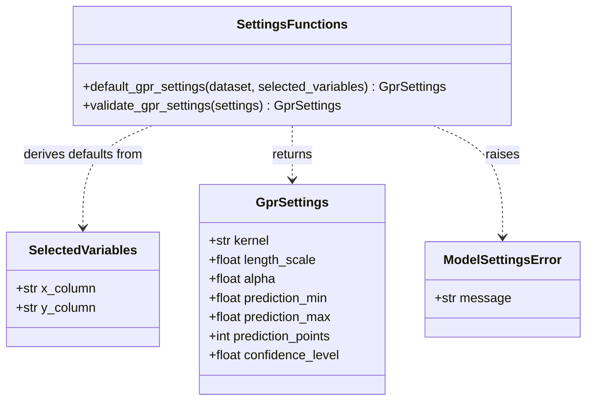
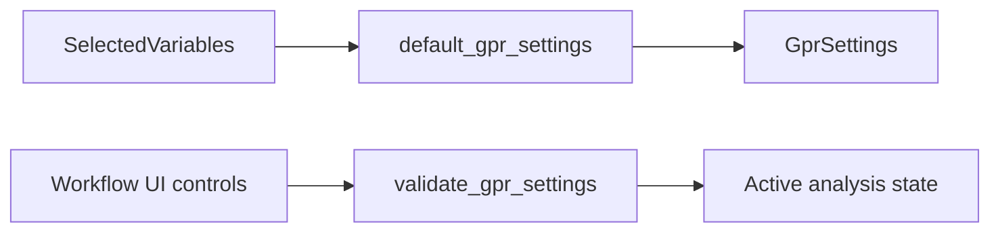

# Implementation Plan - Configure GPR Settings

<!-- implementation-plan | version: 1.0 | issue: 11 | story-version: 1.0 | architecture-version: 1.0 | repository-revision: 2fb7e5d -->

## Scope and Lineage

- Repository issue: `#11` - `US-0003 - Configure GPR Settings`
- Planning batch: `batch-001`
- Source stories: `US-0003`
- Technical review: `TR-002`
- Relevant arc42 concerns: Sections 5, 6, 8
- Container or data store: Streamlit Web Application; In-memory Analysis Session
- Component or data model: Workflow UI; Variable and GPR settings; Active analysis state
- Runtime concern: Settings review before fitting
- Related architecture decisions: ADR-001, ADR-002
- Mapping status: proposed

## Coordination

- Suggested wave: 2
- Upstream dependencies: soft dependency on `#10`
- Downstream dependents: `#12`, `#14`, `#13`
- Parallel-safe with: `#10` if shared dataclass names are coordinated
- Kanban status: Ready with shared-contract open item

## Proposed Code-Level Design

Create settings structures near model logic, then expose them through Streamlit later:

- `src/gaussian_explorer/model.py`
- `GprSettings` frozen dataclass: `kernel`, `length_scale`, `alpha`, `prediction_min`, `prediction_max`, `prediction_points`, `confidence_level`.
- `default_gpr_settings(dataset, selected_variables)` helper.
- `validate_gpr_settings(settings)` for positive scale/noise, valid range, point count, and confidence level.

## Code-Level UML Diagrams

### UML Class Diagram

### Supplemental Data-Flow Sketch

| Diagram | Notation | Architecture element | arc42 concern | Boundary check |
|---|---|---|---|---|
| UML class diagram | `classDiagram` | Variable and GPR settings; Active analysis state | Sections 5, 8 | Captures user-editable analysis parameters only. |
| Supplemental data-flow sketch | `flowchart` | Workflow UI; Variable and GPR settings | Sections 5, 6, 8 | Streamlit widgets store values in memory only. |

### Files and Structures

| Path | Action | Purpose | Architecture element | arc42 concern |
|---|---|---|---|---|
| `src/gaussian_explorer/model.py` | Create | GPR settings dataclass and validation. | Variable and GPR settings | Sections 5, 6, 8 |
| `tests/unit/test_model_settings.py` | Create | Defaults and changed settings tests. | Variable and GPR settings | Sections 8, 10 |

## Implementation Increments

### Increment 1 - Settings Dataclass and Defaults

- Developer tests: defaults expose all approved settings; prediction range defaults to selected X range.
- Implementation change: add immutable `GprSettings` and default builder.
- Verification: `uv run pytest tests/unit/test_model_settings.py`
- Completion condition: settings object can be stored and reused by fitting/export.

### Increment 2 - Settings Validation

- Developer tests: invalid kernel, non-positive length scale/alpha, invalid range, point count, and confidence level are rejected.
- Implementation change: add `validate_gpr_settings` with clear exception messages.
- Verification: `uv run pytest tests/unit/test_model_settings.py`
- Completion condition: changed settings can be accepted safely before fitting.

## Data, Configuration, Migration, and Recovery

No secrets or migration. Settings are analysis parameters, not deployment configuration.

## Risks, Dependencies, and Open Questions

Kernel choices should initially stay small and compatible with the chosen fitting library in `#12`.

## Routes to Upstream Skills

Route new model families or persistent presets to product/architecture.

## Readiness

- Assessment: `ready-with-open-items`
- Date: `2026-07-16`
