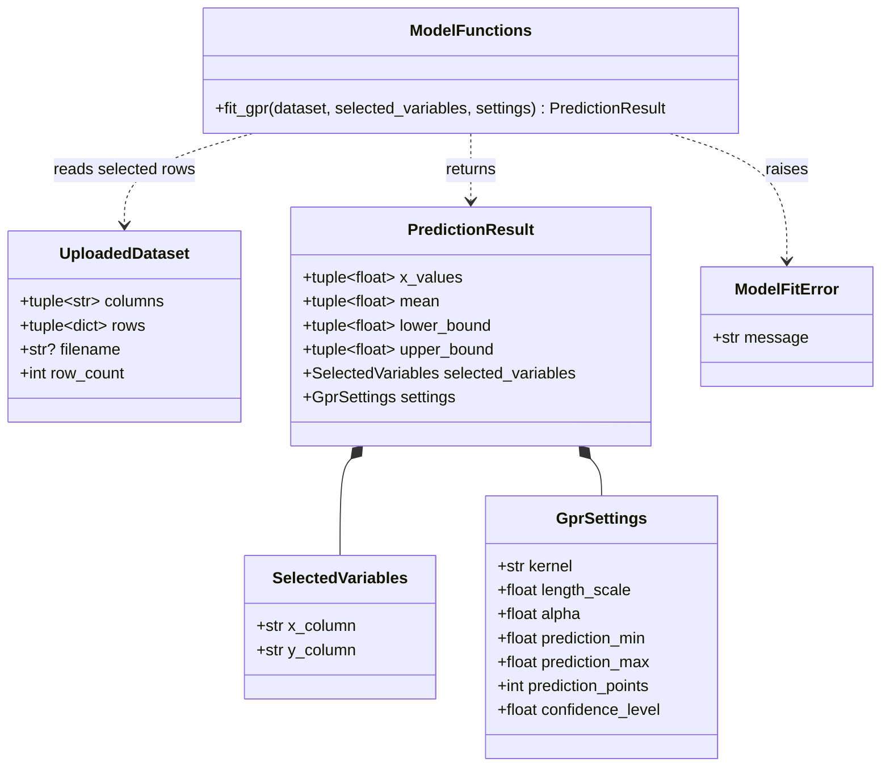
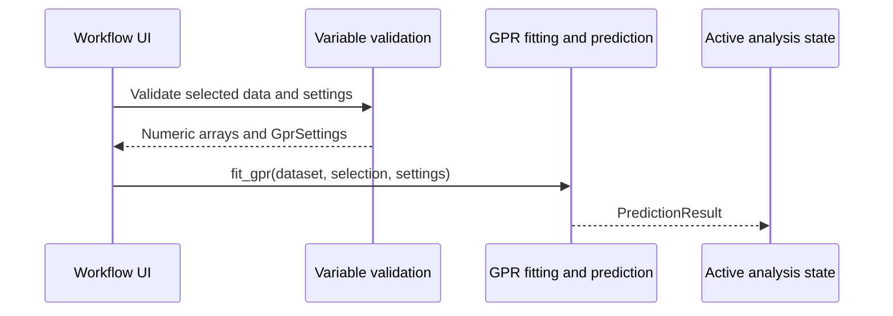

# Implementation Plan - Fit the Gaussian Process Regression Model

<!-- implementation-plan | version: 1.0 | issue: 12 | story-version: 1.0 | architecture-version: 1.0 | repository-revision: 2fb7e5d -->

## Scope and Lineage

- Repository issue: `#12` - `US-0004 - Fit the Gaussian Process Regression Model`
- Planning batch: `batch-001`
- Source stories: `US-0004`
- Technical review: `TR-002`
- Relevant arc42 concerns: Sections 5, 6, 8, 10
- Container or data store: Streamlit Web Application; In-memory Analysis Session
- Component or data model: GPR fitting and prediction; Variable and GPR settings; Active analysis state
- Runtime concern: Model fitting gate
- Related architecture decisions: ADR-001, ADR-002
- Mapping status: proposed

## Coordination

- Suggested wave: 3
- Upstream dependencies: `#9`, `#10`, `#11`
- Downstream dependents: `#16`, `#14`, `#13`
- Parallel-safe with: selected-data validation slice of `#15`
- Kanban status: Blocked until upstream contracts exist

## Proposed Code-Level Design

Extend `src/gaussian_explorer/model.py`:

- Add runtime dependency candidates in `pyproject.toml`: `numpy`, `scikit-learn`, and optionally `pandas` if selected-data conversion needs it.
- `PredictionResult` frozen dataclass with `x_values`, `mean`, `lower_bound`, `upper_bound`, `settings`, and selected variable names.
- `fit_gpr(dataset, selected_variables, settings) -> PredictionResult`.
- Convert selected columns to numeric arrays, sort by X for stable plotting/export, and compute confidence bounds from predictive standard deviation.

## Code-Level UML Diagrams

### UML Class Diagram

### UML Sequence Diagram

| Diagram | Notation | Architecture element | arc42 concern | Boundary check |
|---|---|---|---|---|
| UML class diagram | `classDiagram` | GPR fitting and prediction; Active analysis state | Sections 5, 8, 10 | Result object remains in Streamlit session memory. |
| UML sequence diagram | `sequenceDiagram` | GPR fitting and prediction; Active analysis state | Sections 5, 6, 8, 10 | No backend service or persistent model store. |

### Files and Structures

| Path | Action | Purpose | Architecture element | arc42 concern |
|---|---|---|---|---|
| `pyproject.toml` | Modify | Declare numerical/modeling dependencies. | GPR fitting and prediction | Sections 2, 5 |
| `src/gaussian_explorer/model.py` | Modify | Fit model and produce prediction result. | GPR fitting and prediction | Sections 5, 6, 10 |
| `tests/unit/test_model_fitting.py` | Create | Validate output shape, bounds, and settings use. | GPR fitting and prediction | Sections 8, 10 |

## Implementation Increments

### Increment 1 - Dependency and Prediction Contract

- Developer tests: `PredictionResult` carries selected variables, settings, and arrays with configured length.
- Implementation change: declare dependencies and add result dataclass.
- Verification: `uv run pytest tests/unit/test_model_fitting.py`
- Completion condition: visualization/export can code against a stable result object.

### Increment 2 - Fit and Predict

- Developer tests: valid small dataset produces prediction mean and uncertainty bounds; changed settings alter prediction grid.
- Implementation change: fit a Gaussian Process model and compute confidence bounds.
- Verification: `uv run pytest tests/unit/test_model_fitting.py`
- Completion condition: valid analysis inputs produce usable fitted prediction results.

## Data, Configuration, Migration, and Recovery

No migration or secrets. Fitting failures should raise clear domain errors and leave previous session state untouched in the UI integration.

## Risks, Dependencies, and Open Questions

Concrete kernel mapping must stay aligned with `GprSettings`. Numerical tolerances in tests should avoid brittle exact predictions.

## Routes to Upstream Skills

Route long-running jobs, remote compute, persisted models, or new model families to architecture/product.

## Readiness

- Assessment: `ready-with-open-items`
- Date: `2026-07-16`
