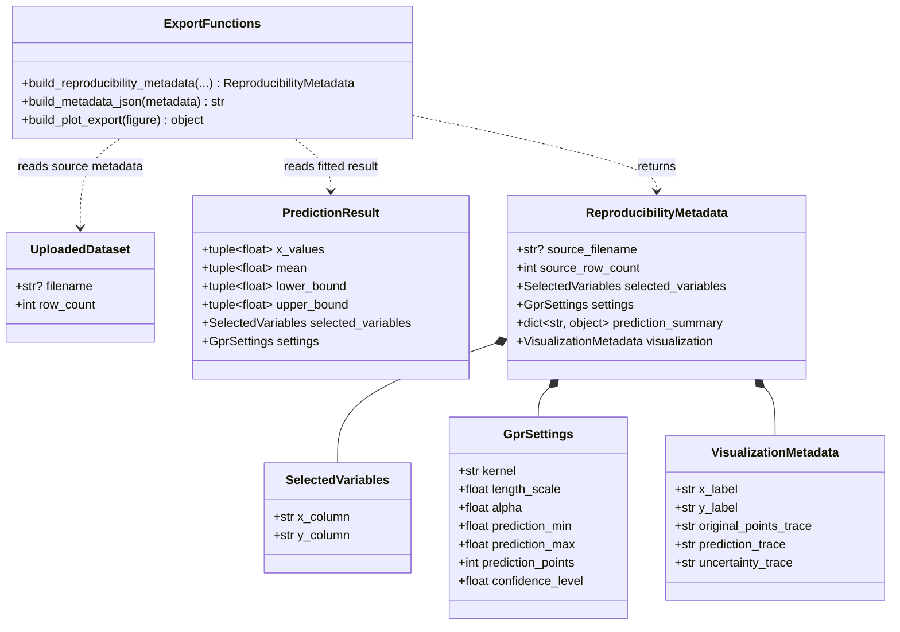
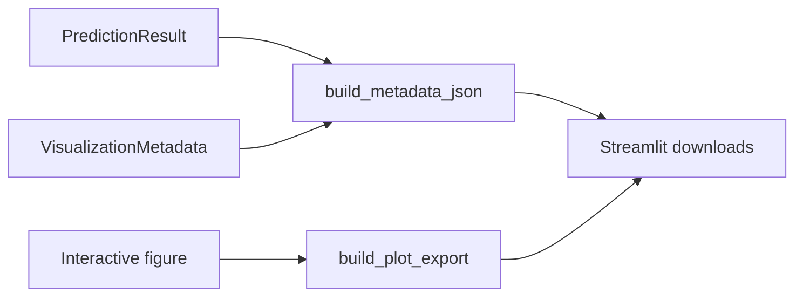

# Implementation Plan - Export Plot and Reproducibility Metadata

<!-- implementation-plan | version: 1.0 | issue: 13 | story-version: 1.0 | architecture-version: 1.0 | repository-revision: 2fb7e5d -->

## Scope and Lineage

- Repository issue: `#13` - `US-0007 - Export Plot and Reproducibility Metadata`
- Planning batch: `batch-001`
- Source stories: `US-0007`
- Technical review: `TR-002`
- Relevant arc42 concerns: Sections 5, 6, 8, 10
- Component or data model: Prediction and uncertainty visualization; Export generation; Active analysis state
- Runtime concern: Plot and metadata export after visualization
- Related architecture decisions: ADR-001, ADR-002
- Mapping status: proposed

## Coordination

- Suggested wave: 5
- Upstream dependencies: `#12`, `#16`
- Downstream dependents: none
- Parallel-safe with: none until visualization metadata is stable
- Kanban status: Blocked by fitted-result and visualization contracts

## Proposed Code-Level Design

Extend `src/gaussian_explorer/export.py` and reuse `src/gaussian_explorer/visualization.py`:

- `build_reproducibility_metadata(dataset, selected_variables, settings, prediction_result, visualization_metadata) -> dict[str, object]`.
- `build_metadata_json(...) -> str` with deterministic sorted keys.
- `build_plot_export(figure) -> bytes | str` depending on chosen plot library support.
- Avoid server-side saved sessions; all artifacts are generated on demand from active state.

## Code-Level UML Diagrams

### UML Class Diagram

### Supplemental Data-Flow Sketch

| Diagram | Notation | Architecture element | arc42 concern | Boundary check |
|---|---|---|---|---|
| UML class diagram | `classDiagram` | Export generation; Prediction visualization; Active analysis state | Sections 5, 8, 10 | Metadata is a generated artifact, not persisted server state. |
| Supplemental data-flow sketch | `flowchart` | Export generation; Prediction visualization | Sections 5, 6, 8, 10 | Uses active analysis state, no persistence. |

## Implementation Increments

### Increment 1 - Reproducibility Metadata

- Affected files: `src/gaussian_explorer/export.py`, `tests/unit/test_export.py`
- Developer tests: metadata includes selected variables, model settings, prediction summary, plot labels, and source filename when present.
- Implementation change: deterministic JSON metadata builder.
- Verification: `uv run pytest tests/unit/test_export.py`
- Completion condition: metadata is sufficient to reproduce the analysis later.

### Increment 2 - Plot Export Payload

- Affected files: `src/gaussian_explorer/export.py`, `tests/unit/test_export.py`
- Developer tests: plot export returns non-empty payload from visualization figure.
- Implementation change: serialize plot as HTML or image based on available dependency support.
- Verification: `uv run pytest tests/unit/test_export.py`
- Completion condition: plot and metadata are available for download after visualization.

## Risks, Dependencies, and Open Questions

Static image export may require additional dependencies. If that adds heavy system dependencies, prefer an HTML plot export unless product requires a bitmap.

## Routes to Upstream Skills

Route a mandatory image format requirement to product clarification if not already accepted.

## Readiness

- Assessment: `ready-with-open-items`
- Date: `2026-07-16`
