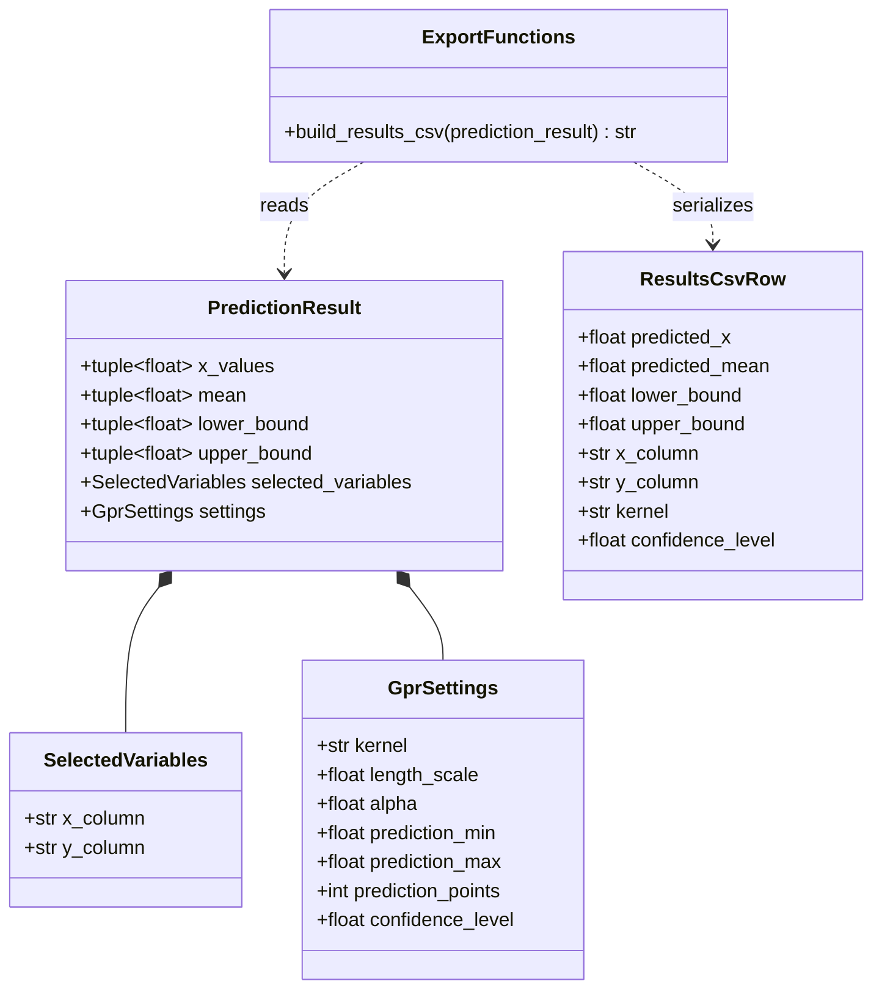

# Implementation Plan - Export Tabular Prediction Results

<!-- implementation-plan | version: 1.0 | issue: 14 | story-version: 1.0 | architecture-version: 1.0 | repository-revision: 2fb7e5d -->

## Scope and Lineage

- Repository issue: `#14` - `US-0006 - Export Tabular Prediction Results`
- Planning batch: `batch-001`
- Source stories: `US-0006`
- Technical review: `TR-002`
- Relevant arc42 concerns: Sections 5, 6, 8, 10
- Component or data model: Export generation; GPR fitting and prediction; Variable and GPR settings; Active analysis state
- Runtime concern: Export download after fitting
- Related architecture decisions: ADR-001, ADR-002
- Mapping status: proposed

## Coordination

- Suggested wave: 4
- Upstream dependencies: `#12`
- Downstream dependents: none
- Parallel-safe with: `#16`
- Kanban status: Blocked by fitted-result contract

## Proposed Code-Level Design

Create `src/gaussian_explorer/export.py`:

- `build_results_csv(prediction_result) -> str`.
- Include predicted X values, predicted mean, lower/upper uncertainty bounds, selected X/Y column names, and model settings.
- Keep CSV generation deterministic for tests and reproducibility.

## Code-Level UML Diagrams

### UML Class Diagram

### Supplemental Data-Flow Sketch

| Diagram | Notation | Architecture element | arc42 concern | Boundary check |
|---|---|---|---|---|
| UML class diagram | `classDiagram` | Export generation; Active analysis state | Sections 5, 8, 10 | CSV rows are derived from fitted result state. |
| Supplemental data-flow sketch | `flowchart` | Export generation; Active analysis state | Sections 5, 6, 8, 10 | Generated from fitted in-memory state only. |

## Implementation Increments

### Increment 1 - Results CSV Builder

- Affected files: `src/gaussian_explorer/export.py`, `tests/unit/test_export.py`
- Developer tests: CSV contains required columns and one row per prediction point.
- Implementation change: serialize prediction result fields and settings into CSV.
- Verification: `uv run pytest tests/unit/test_export.py`
- Completion condition: tabular results can be downloaded after fitting.

### Increment 2 - Stable Metadata Columns

- Affected files: `src/gaussian_explorer/export.py`, `tests/unit/test_export.py`
- Developer tests: selected X/Y names and model settings are present and deterministic.
- Implementation change: encode settings as repeated columns or a deterministic metadata section, favoring easy CSV consumption.
- Verification: `uv run pytest tests/unit/test_export.py`
- Completion condition: exported CSV supports later review of the analysis.

## Risks, Dependencies, and Open Questions

If the team wants a separate metadata sidecar instead of repeated CSV columns, route product acceptance for US-0006/US-0007 before changing scope.

## Readiness

- Assessment: `ready-with-open-items`
- Date: `2026-07-16`
