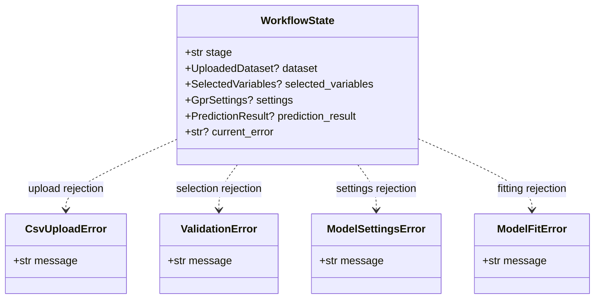
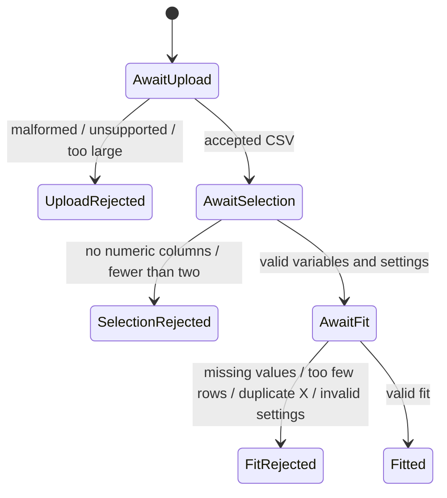

# Implementation Plan - Receive Clear Invalid-Input Feedback

<!-- implementation-plan | version: 1.0 | issue: 15 | story-version: 1.0 | architecture-version: 1.0 | repository-revision: 2fb7e5d -->

## Scope and Lineage

- Repository issue: `#15` - `US-0008 - Receive Clear Invalid-Input Feedback`
- Planning batch: `batch-001`
- Source stories: `US-0008`
- Technical review: `TR-002`
- Relevant arc42 concerns: Sections 3, 5, 6, 8, 10
- Component or data model: Workflow UI; CSV parsing and validation; Variable and GPR settings; GPR fitting and prediction; Active analysis state
- Runtime concern: Upload, selection, and fitting validation gates
- Related architecture decisions: ADR-001, ADR-002
- Mapping status: confirmed / proposed

## Coordination

- Suggested wave: split across waves 1, 2, and 3
- Upstream dependencies: `#9`, `#10`, `#12`
- Downstream dependents: release validation
- Parallel-safe with: coordinated slices of `#9`, `#10`, and `#12`
- Kanban status: Ready as cross-cutting validation plan

## Proposed Code-Level Design

Use shared domain exceptions and validation helpers rather than UI-only checks:

- Upload errors in `src/gaussian_explorer/data.py`.
- Selection and selected-data errors in `src/gaussian_explorer/validation.py`.
- Settings and fitting errors in `src/gaussian_explorer/model.py`.
- Streamlit workflow catches these exceptions and shows clear messages without advancing downstream state.

## Code-Level UML Diagrams

### UML Class Diagram

### UML State Machine Diagram

| Diagram | Notation | Architecture element | arc42 concern | Boundary check |
|---|---|---|---|---|
| UML class diagram | `classDiagram` | Workflow UI; CSV validation; Variable settings; GPR fitting | Sections 5, 8, 10 | Error objects are translated into UI feedback without downstream state mutation. |
| UML state machine diagram | `stateDiagram-v2` | Workflow UI; CSV validation; Variable settings; GPR fitting | Sections 3, 5, 6, 8, 10 | Prevents progression in the same Streamlit session state. |

## Implementation Increments

### Increment 1 - Upload Rejection Coverage

- Affected files: `src/gaussian_explorer/data.py`, `tests/unit/test_data.py`
- Developer tests: malformed CSV, unsupported file, very large file, duplicate headers, and no data rows reject with clear messages.
- Implementation change: normalize upload errors under `CsvUploadError`.
- Verification: `uv run pytest tests/unit/test_data.py`
- Dependencies: coordinated with `#9`
- Completion condition: unusable uploaded files cannot reach variable selection.

### Increment 2 - Selection Rejection Coverage

- Affected files: `src/gaussian_explorer/validation.py`, `tests/unit/test_validation.py`
- Developer tests: no numeric columns and fewer than two selectable numeric columns reject clearly.
- Implementation change: add reusable validation errors for variable selection.
- Verification: `uv run pytest tests/unit/test_validation.py`
- Dependencies: coordinated with `#10`
- Completion condition: invalid datasets cannot proceed to fitting.

### Increment 3 - Fitting Rejection Coverage

- Affected files: `src/gaussian_explorer/validation.py`, `src/gaussian_explorer/model.py`, fitting tests
- Developer tests: missing selected values, too few rows, duplicate X values, and invalid settings reject before or during fitting.
- Implementation change: validate selected numeric arrays before fitting and preserve previous valid state in UI integration.
- Verification: `uv run pytest tests/unit/test_validation.py tests/unit/test_model_fitting.py`
- Dependencies: coordinated with `#12`
- Completion condition: invalid selected data cannot produce prediction results.

## Data, Configuration, Migration, and Recovery

No migration. Recovery behavior is UI-level: show the message and keep the user at the current workflow gate.

## Risks, Dependencies, and Open Questions

Exact minimum row count and upload-size limit are implementation choices unless product specifies them. Record chosen constants in tests.

## Routes to Upstream Skills

Route additional invalid-input categories or changed thresholds with product impact to Skills B/C/D.

## Readiness

- Assessment: `ready-with-open-items`
- Date: `2026-07-16`
