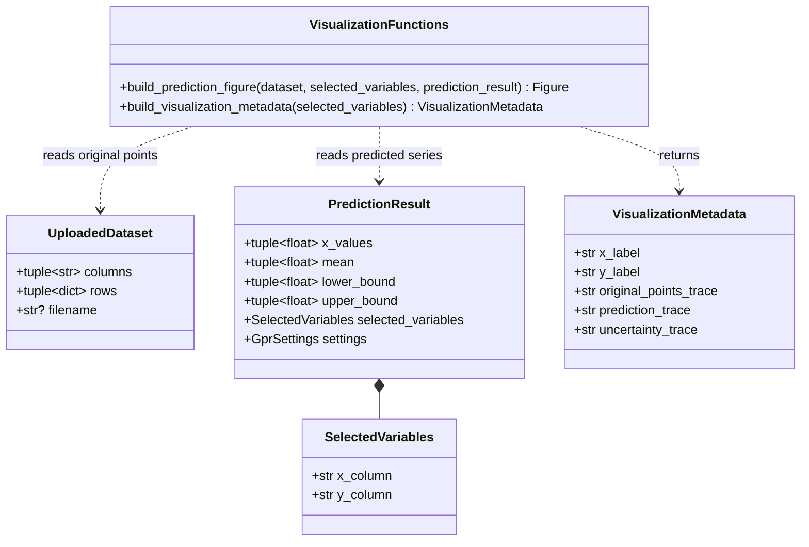
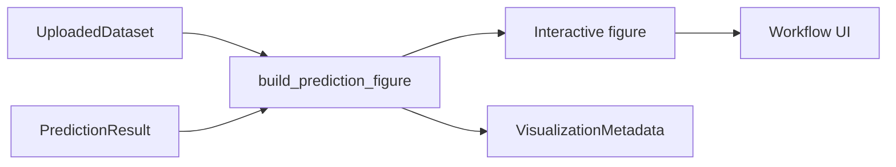

# Implementation Plan - View Prediction and Uncertainty

<!-- implementation-plan | version: 1.0 | issue: 16 | story-version: 1.0 | architecture-version: 1.0 | repository-revision: 2fb7e5d -->

## Scope and Lineage

- Repository issue: `#16` - `US-0005 - View Prediction and Uncertainty`
- Planning batch: `batch-001`
- Source stories: `US-0005`
- Technical review: `TR-002`
- Relevant arc42 concerns: Sections 5, 6, 8, 10
- Component or data model: Prediction and uncertainty visualization; GPR fitting and prediction; Active analysis state
- Runtime concern: Result visualization after fitting
- Related architecture decisions: ADR-001, ADR-002
- Mapping status: proposed

## Coordination

- Suggested wave: 4
- Upstream dependencies: `#12`
- Downstream dependents: `#13`
- Parallel-safe with: `#14`
- Kanban status: Blocked by fitted-result contract

## Proposed Code-Level Design

Create `src/gaussian_explorer/visualization.py`:

- `build_prediction_figure(dataset, selected_variables, prediction_result)` returns a Plotly figure or equivalent interactive chart object.
- Proposed dependency: `plotly` for interactive Streamlit rendering and reusable plot export paths.
- Visualization includes original points, predicted mean line, and confidence/uncertainty band.
- `VisualizationMetadata` dataclass records axis labels and trace names for reproducibility export.

## Code-Level UML Diagrams

### UML Class Diagram

### Supplemental Data-Flow Sketch

| Diagram | Notation | Architecture element | arc42 concern | Boundary check |
|---|---|---|---|---|
| UML class diagram | `classDiagram` | Prediction and uncertainty visualization; Active analysis state | Sections 5, 8, 10 | Figure metadata is derived from fitted in-memory state. |
| Supplemental data-flow sketch | `flowchart` | Prediction and uncertainty visualization | Sections 5, 6, 10 | Reads fitted state; does not own fitting or export persistence. |

## Implementation Increments

### Increment 1 - Figure Builder

- Affected files: `src/gaussian_explorer/visualization.py`, `tests/unit/test_visualization.py`, `pyproject.toml`
- Developer tests: figure contains original data, predicted mean, and uncertainty band traces.
- Implementation change: build figure from `PredictionResult` and selected dataset rows.
- Verification: `uv run pytest tests/unit/test_visualization.py`
- Completion condition: fitted results can be rendered in Streamlit.

### Increment 2 - Visualization Metadata

- Affected files: `src/gaussian_explorer/visualization.py`, `tests/unit/test_visualization.py`
- Developer tests: metadata includes selected X/Y names and trace labels.
- Implementation change: return or expose metadata for `#13`.
- Verification: `uv run pytest tests/unit/test_visualization.py`
- Completion condition: plot export can reproduce chart context.

## Risks, Dependencies, and Open Questions

Plot library choice is implementation-owned unless it changes runtime/deployment boundaries.

## Readiness

- Assessment: `ready-with-open-items`
- Date: `2026-07-16`
