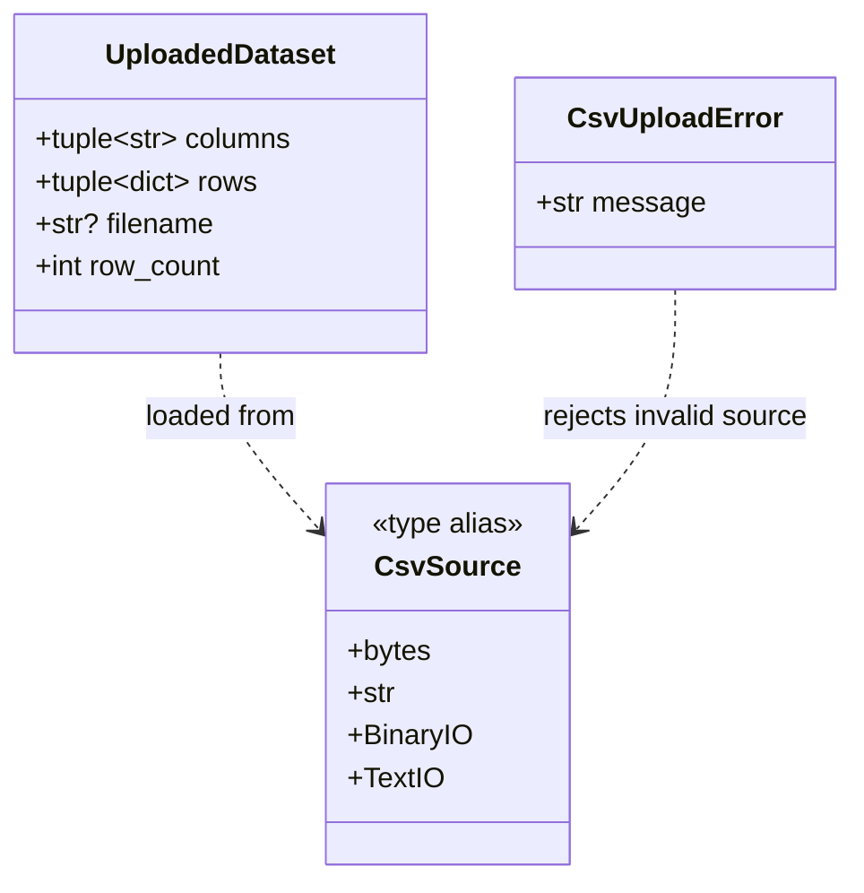
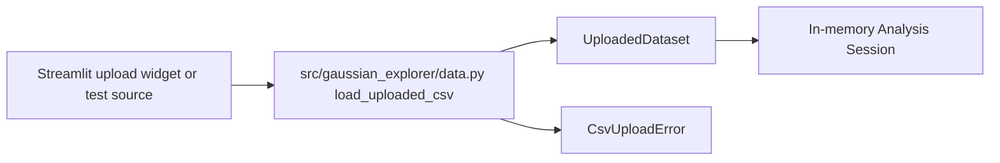

# Implementation Plan - Upload Experimental CSV Data

<!-- implementation-plan | version: 1.0 | issue: 9 | story-version: 1.0 | architecture-version: 1.0 | repository-revision: 2fb7e5d -->

## Scope and Lineage

- Repository issue: `#9` - `US-0001 - Upload Experimental CSV Data`
- Planning batch: `batch-001`
- Source stories: `US-0001`
- Technical review: `TR-002`
- Architecture document: `sdlc_docs/02_architecture/00_architecture_document.md`
- Relevant arc42 concerns: Sections 3, 5, 6, 8
- Software system: Gaussian Process Regression Web Application
- Container or data store: Streamlit Web Application; In-memory Analysis Session
- Component or data model: Workflow UI; CSV parsing and validation; Active analysis state
- Runtime or deployment concern: CSV upload gate
- Related architecture decisions: ADR-001, ADR-002
- Mapping status: confirmed for `src/gaussian_explorer/data.py`; proposed for Streamlit entry point

## Coordination

- Suggested wave: 1
- Upstream dependencies: none
- Downstream dependents: `#10`, `#12`, `#15`
- Parallel-safe with: first upload-validation slice of `#15`
- Assignment notes: Treat `src/gaussian_explorer/data.py` as the accepted dataset contract unless implementation evidence proves a better local name.
- Kanban status: Ready

## Architecture Constraints to Preserve

Keep upload data in memory; do not add database, server-side persistence, background workers, or external parsing services. Uploaded files are untrusted and must be parsed without executing uploaded content.

## Current Implementation Context

`src/gaussian_explorer/data.py` already defines `UploadedDataset`, `CsvUploadError`, and `load_uploaded_csv`. `tests/unit/test_data.py` covers bytes, text file-like, binary file-like, no data rows, and duplicate headers. `pyproject.toml` already declares Streamlit.

## Proposed Code-Level Design

Extend the existing CSV intake module with explicit file metadata validation and a stable accepted-dataset object for later numeric selection. Proposed additions:

- `MAX_UPLOAD_BYTES` constant with a conservative implementation-level threshold.
- `SUPPORTED_UPLOAD_SUFFIXES = (".csv",)` for filename checks.
- `load_uploaded_csv(..., max_bytes: int = MAX_UPLOAD_BYTES)` to reject oversized raw bytes/file-like uploads when measurable.
- Keep `UploadedDataset.columns` and `UploadedDataset.rows` immutable tuples.
- Defer Streamlit widget code to a later app entry module unless this issue includes a minimal upload screen.

## Code-Level UML Diagrams

### UML Class Diagram

### Supplemental Data-Flow Sketch

| Diagram | Notation | Architecture element | arc42 concern | Boundary check |
|---|---|---|---|---|
| UML class diagram | `classDiagram` | CSV parsing and validation; Active analysis state | Sections 5, 8 | Represents only in-memory uploaded data and upload errors. |
| Supplemental data-flow sketch | `flowchart` | CSV parsing and validation; Active analysis state | Sections 3, 5, 6, 8 | Stays inside Streamlit Web Application and in-memory state. |

### Files and Structures

| Path | Action | Purpose | Architecture element | arc42 concern |
|---|---|---|---|---|
| `src/gaussian_explorer/data.py` | Modify | Strengthen upload parsing, metadata, and size/type rejection. | CSV parsing and validation | Sections 3, 5, 6, 8 |
| `tests/unit/test_data.py` | Modify | Cover supported CSV acceptance and upload rejection cases. | CSV parsing and validation | Sections 8, 10 |

## Implementation Increments

### Increment 1 - Stabilize Upload Contract

- Architecture element: CSV parsing and validation
- arc42 concern: Sections 5, 6
- Affected files: `src/gaussian_explorer/data.py`, `tests/unit/test_data.py`
- Developer tests: supported CSV with multiple columns remains accepted; malformed/empty/headerless cases reject.
- Implementation change: keep immutable `UploadedDataset`; improve parser validation messages as needed.
- Verification: `uv run pytest tests/unit/test_data.py`
- Dependencies: none
- Completion condition: uploaded CSV data is represented consistently for variable selection.

### Increment 2 - Add File Metadata Guards

- Architecture element: CSV upload gate
- arc42 concern: Sections 3, 8
- Affected files: `src/gaussian_explorer/data.py`, `tests/unit/test_data.py`
- Developer tests: unsupported suffix and oversized measurable uploads raise `CsvUploadError`.
- Implementation change: add suffix and byte-size checks without adding persistence.
- Verification: `uv run pytest tests/unit/test_data.py`
- Dependencies: none
- Completion condition: accepted and rejected upload paths match `US-0001` and prepare `US-0008`.

## Data, Configuration, Migration, and Recovery

No migration or secrets. Upload limit is an implementation constant; if product wants a different threshold, route to requirements.

## Quality and Operational Verification

Unit tests cover parsing and rejection. Later Streamlit workflow tests should verify rejected uploads prevent variable selection.

## Risks, Dependencies, and Open Questions

The exact upload-size threshold is not specified upstream; record the chosen value in code/tests and keep it conservative.

## Routes to Upstream Skills

Route new supported file types or persistent uploads to Skills B/C/D and E.

## Readiness

- Assessment: `ready`
- Approver, when required: pending
- Date: `2026-07-16`
