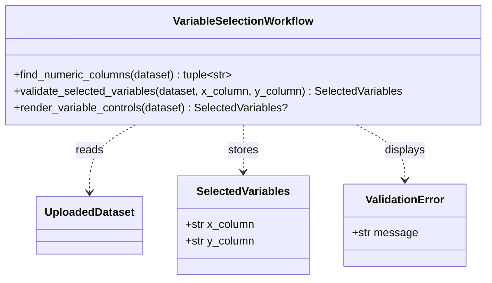
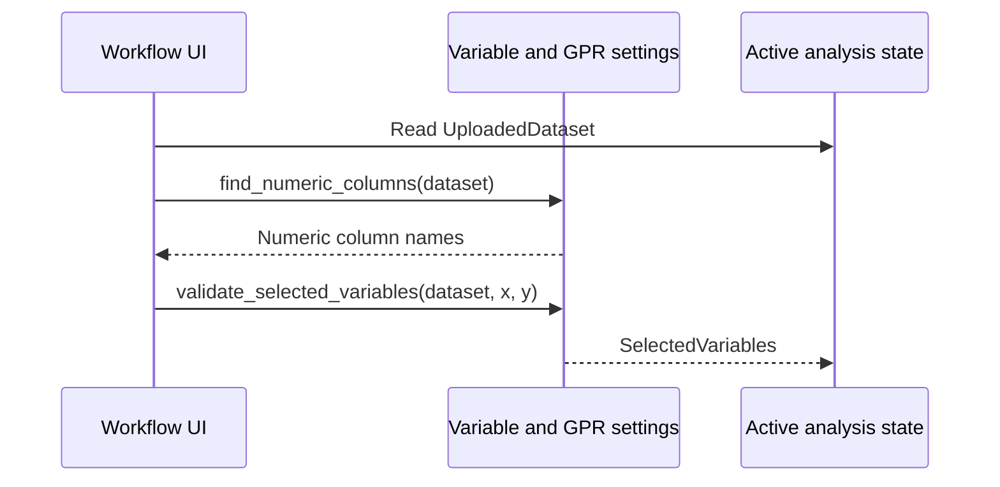

# Implementation Plan - Select Regression Variables

<!-- implementation-plan | version: 2.0 | issue: 10 | story-version: 1.0 | architecture-version: 1.0 | repository-revision: 2fb7e5d -->

## Scope and Lineage

- Repository issue: `#10` - `US-0002 - Select Regression Variables`
- Planning batch: `batch-002`
- Reconciliation batch, when applicable: `registry-repair-001`
- Source stories: `US-0002`
- Technical review: `TR-002`
- Architecture document: `sdlc_docs/02_architecture/00_architecture_document.md`
- Relevant arc42 concerns: Sections 5, 6, 8
- Software system: Gaussian Process Regression Web Application
- Container or data store: Streamlit Web Application; In-memory Analysis Session
- Component or data model: Variable and GPR settings; CSV parsing and validation; Active analysis state
- Runtime or deployment concern: Variable selection gate
- Related architecture decisions: ADR-001, ADR-002
- Mapping status: proposed

## Coordination

- Suggested wave: 2
- Upstream dependencies: `#9`
- Downstream dependents: `#11`, `#12`, `#15`
- Parallel-safe with: `#11` after `SelectedVariables` is stable
- Assignment notes: This is a vertical slice: numeric detection, selection UI, state, and tests.
- Kanban status: Ready

## Architecture Constraints to Preserve

Use only the accepted in-memory dataset. Do not create derived persistent datasets or add external data processing services.

## Current Implementation Context

`UploadedDataset.rows` currently stores string values. No validation module or variable-selection UI exists.

## Proposed Code-Level Design

- Create `src/gaussian_explorer/validation.py`.
- Add `SelectedVariables(x_column: str, y_column: str)`.
- Add `find_numeric_columns(dataset) -> tuple[str, ...]` using full-column numeric parsing.
- Add `validate_selected_variables(dataset, x_column, y_column) -> SelectedVariables`.
- Extend `src/gaussian_explorer/app.py` with X/Y select boxes shown only after an accepted dataset exists.
- Store `st.session_state["selected_variables"]`.

## Code-Level UML Diagrams

### UML Class Diagram

### UML Sequence Diagram

### Diagram Mapping

| Diagram | Notation | Architecture element | arc42 concern | Boundary check |
|---|---|---|---|---|
| UML class diagram | `classDiagram` | Variable and GPR settings; Active analysis state | Sections 5, 8 | Selection state remains in memory. |
| UML sequence diagram | `sequenceDiagram` | Variable selection gate | Sections 5, 6 | Reads only accepted upload state. |

### Files and Structures

| Path | Action | Purpose | Architecture element | arc42 concern |
|---|---|---|---|---|
| `src/gaussian_explorer/validation.py` | Create | Numeric-column discovery and variable validation. | Variable and GPR settings | Sections 5, 6, 8 |
| `src/gaussian_explorer/app.py` | Modify | Render X/Y controls and store selected variables. | Workflow UI; Active analysis state | Sections 5, 6 |
| `tests/unit/test_validation.py` | Create | Test numeric detection and selection rules. | Variable and GPR settings | Sections 8, 10 |
| `tests/integration/test_app_workflow.py` | Modify | Verify variable controls appear after upload and store state. | Workflow UI | Sections 6, 8 |

## Implementation Increments

### Increment 1 - Numeric Column Detection

- Architecture element: Variable and GPR settings
- arc42 concern: Sections 5, 6, 8
- Affected files: `src/gaussian_explorer/validation.py`, `tests/unit/test_validation.py`
- Developer tests: all-numeric integer/float columns accepted; text and mixed text columns excluded; no numeric columns returns empty tuple.
- Implementation change: add full-column numeric parsing helper without mutating `UploadedDataset`.
- Verification: `uv run pytest tests/unit/test_validation.py`
- Dependencies: `#9` dataset contract
- Completion condition: app can derive selectable numeric columns.

### Increment 2 - Selection UI and State

- Architecture element: Workflow UI; Active analysis state
- arc42 concern: Sections 5, 6, 8
- Affected files: `src/gaussian_explorer/app.py`, `tests/integration/test_app_workflow.py`
- Developer tests: X/Y select boxes render for at least two numeric columns; same-column selection is rejected; valid selection stores `SelectedVariables`.
- Implementation change: add Streamlit select boxes and store validated selection in session state.
- Verification: `uv run pytest tests/integration/test_app_workflow.py`
- Dependencies: Increment 1
- Completion condition: selected variables are recorded for model settings and fitting.

## Data, Configuration, Migration, and Recovery

No migration. Changing the uploaded dataset clears stale selected variables.

## Quality and Operational Verification

Unit tests cover detection; integration tests cover state transition from upload to selection.

## Risks, Dependencies, and Open Questions

Missing values in selected columns are handled by `#15` at fitting validation, not by candidate-column discovery.

## Routes to Upstream Skills

Derived variables, multi-output regression, or categorical regression route to product/story review.

## Readiness

- Assessment: `ready`
- Approver, when required: pending
- Date: `2026-07-16`
