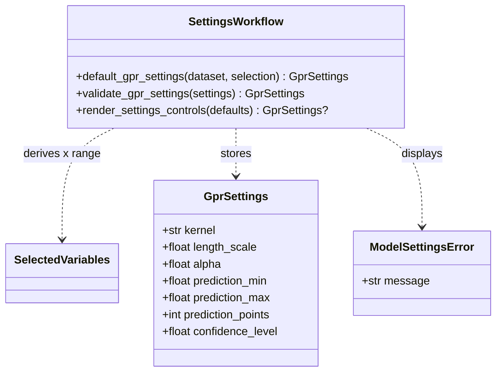
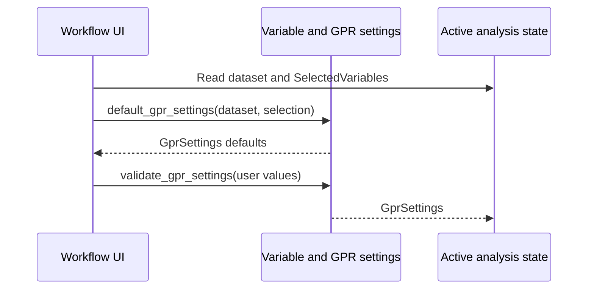

# Implementation Plan - Configure GPR Settings

<!-- implementation-plan | version: 2.0 | issue: 11 | story-version: 1.0 | architecture-version: 1.0 | repository-revision: 2fb7e5d -->

## Scope and Lineage

- Repository issue: `#11` - `US-0003 - Configure GPR Settings`
- Planning batch: `batch-002`
- Reconciliation batch, when applicable: `registry-repair-001`
- Source stories: `US-0003`
- Technical review: `TR-002`
- Architecture document: `sdlc_docs/02_architecture/00_architecture_document.md`
- Relevant arc42 concerns: Sections 5, 6, 8
- Software system: Gaussian Process Regression Web Application
- Container or data store: Streamlit Web Application; In-memory Analysis Session
- Component or data model: Workflow UI; Variable and GPR settings; Active analysis state
- Runtime or deployment concern: Settings review before fitting
- Related architecture decisions: ADR-001, ADR-002
- Mapping status: proposed

## Coordination

- Suggested wave: 2
- Upstream dependencies: soft dependency on `#10`
- Downstream dependents: `#12`, `#14`, `#13`
- Parallel-safe with: `#10` once `SelectedVariables` is named
- Assignment notes: This is a vertical slice: settings dataclass, defaults, validation, UI, and state.
- Kanban status: Ready

## Architecture Constraints to Preserve

GPR settings are user-editable analysis parameters, not deployment configuration or saved presets.

## Current Implementation Context

No model/settings module exists. `pyproject.toml` currently declares Streamlit only.

## Proposed Code-Level Design

- Create `src/gaussian_explorer/model.py`.
- Add `GprSettings` with `kernel`, `length_scale`, `alpha`, `prediction_min`, `prediction_max`, `prediction_points`, and `confidence_level`.
- Supported initial kernels: `RBF`, `Matern`, `RationalQuadratic`.
- Validation rules: positive `length_scale`, positive `alpha`, `prediction_min < prediction_max`, `10 <= prediction_points <= 1000`, and `0.5 < confidence_level < 0.99`.
- Extend `app.py` with settings controls after variable selection and store `st.session_state["gpr_settings"]`.

## Code-Level UML Diagrams

### UML Class Diagram

### UML Sequence Diagram

### Diagram Mapping

| Diagram | Notation | Architecture element | arc42 concern | Boundary check |
|---|---|---|---|---|
| UML class diagram | `classDiagram` | Variable and GPR settings | Sections 5, 8 | Analysis parameters only. |
| UML sequence diagram | `sequenceDiagram` | Settings review before fitting | Sections 5, 6 | Stored in active session state only. |

### Files and Structures

| Path | Action | Purpose | Architecture element | arc42 concern |
|---|---|---|---|---|
| `src/gaussian_explorer/model.py` | Create | Define and validate settings. | Variable and GPR settings | Sections 5, 6, 8 |
| `src/gaussian_explorer/app.py` | Modify | Render settings controls and store current settings. | Workflow UI; Active analysis state | Sections 5, 6 |
| `tests/unit/test_model_settings.py` | Create | Test defaults and validation. | Variable and GPR settings | Sections 8, 10 |
| `tests/integration/test_app_workflow.py` | Modify | Verify changed settings flow into session state. | Workflow UI | Sections 6, 8 |

## Implementation Increments

### Increment 1 - Settings Contract and Defaults

- Architecture element: Variable and GPR settings
- arc42 concern: Sections 5, 6, 8
- Affected files: `src/gaussian_explorer/model.py`, `tests/unit/test_model_settings.py`
- Developer tests: defaults include every approved setting and prediction range defaults to selected X min/max.
- Implementation change: add `GprSettings` and `default_gpr_settings`.
- Verification: `uv run pytest tests/unit/test_model_settings.py`
- Dependencies: `#10` selected variable contract; use fixtures if implemented in parallel
- Completion condition: fitting/export can rely on a stable settings object.

### Increment 2 - Settings UI and Validation

- Architecture element: Workflow UI; Active analysis state
- arc42 concern: Sections 5, 6, 8
- Affected files: `src/gaussian_explorer/app.py`, `src/gaussian_explorer/model.py`, `tests/integration/test_app_workflow.py`
- Developer tests: changed settings are validated and stored; invalid settings show an error and do not advance to fitting.
- Implementation change: add Streamlit settings controls and `validate_gpr_settings`.
- Verification: `uv run pytest tests/unit/test_model_settings.py tests/integration/test_app_workflow.py`
- Dependencies: Increment 1
- Completion condition: researcher can review and modify all approved GPR settings before fitting.

## Data, Configuration, Migration, and Recovery

No migration or secrets. Changing selected variables recalculates defaults and clears stale fitted results.

## Quality and Operational Verification

Unit and workflow tests prove defaults exist and user changes are used.

## Risks, Dependencies, and Open Questions

Kernel choices are intentionally limited to the three initial scikit-learn-compatible kernels. New kernels route upstream only if user-visible scope changes.

## Routes to Upstream Skills

Persistent presets, additional model families, or non-GPR settings route to product/architecture.

## Readiness

- Assessment: `ready`
- Approver, when required: pending
- Date: `2026-07-16`
