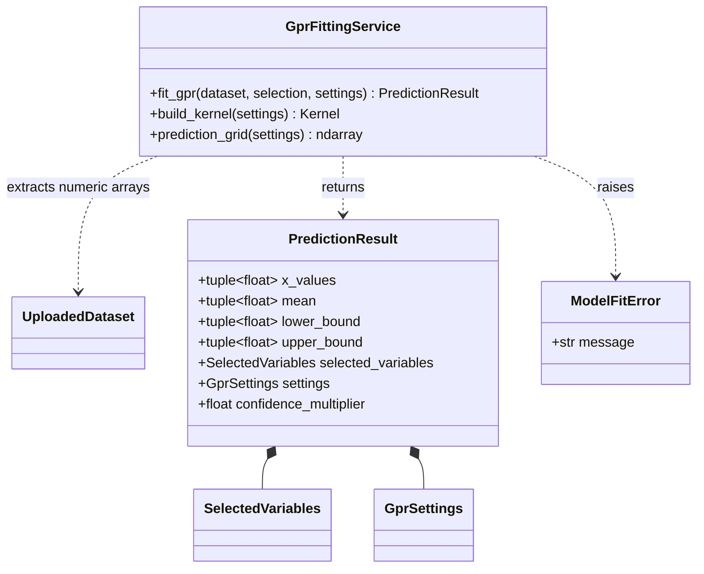
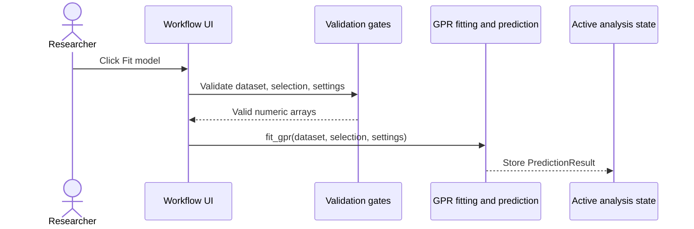

# Implementation Plan - Fit the Gaussian Process Regression Model

<!-- implementation-plan | version: 2.0 | issue: 12 | story-version: 1.0 | architecture-version: 1.0 | repository-revision: 2fb7e5d -->

## Scope and Lineage

- Repository issue: `#12` - `US-0004 - Fit the Gaussian Process Regression Model`
- Planning batch: `batch-002`
- Reconciliation batch, when applicable: `registry-repair-001`
- Source stories: `US-0004`
- Technical review: `TR-002`
- Architecture document: `sdlc_docs/02_architecture/00_architecture_document.md`
- Relevant arc42 concerns: Sections 5, 6, 8, 10
- Software system: Gaussian Process Regression Web Application
- Container or data store: Streamlit Web Application; In-memory Analysis Session
- Component or data model: GPR fitting and prediction; Variable and GPR settings; Active analysis state
- Runtime or deployment concern: Model fitting gate
- Related architecture decisions: ADR-001, ADR-002
- Mapping status: proposed

## Coordination

- Suggested wave: 3
- Upstream dependencies: `#9`, `#10`, `#11`
- Downstream dependents: `#16`, `#14`, `#13`
- Parallel-safe with: fitting-validation slice of `#15`
- Assignment notes: This is a vertical slice: dependencies, fitting service, fit button, result state, and tests.
- Kanban status: Ready after upstream contracts

## Architecture Constraints to Preserve

Fit in process memory for small datasets. Do not add remote compute, saved models, asynchronous jobs, or persistence.

## Current Implementation Context

No fitting code exists. `pyproject.toml` declares Streamlit but not numerical/modeling dependencies.

## Proposed Code-Level Design

- Add runtime dependencies: `numpy`, `scipy`, `scikit-learn`.
- Extend `src/gaussian_explorer/model.py`.
- Add `PredictionResult` with prediction arrays, selected variables, settings, and confidence multiplier.
- Implement `fit_gpr(dataset, selected_variables, settings) -> PredictionResult`.
- Use scikit-learn `GaussianProcessRegressor`.
- Map kernels: `RBF`, `Matern`, `RationalQuadratic`.
- Compute uncertainty bounds as `mean +/- z * std`, where `z = scipy.stats.norm.ppf((1 + confidence_level) / 2)`.
- Sort selected data by X before fitting and generate prediction grid with `numpy.linspace`.
- Store result in `st.session_state["prediction_result"]`.

## Code-Level UML Diagrams

### UML Class Diagram

### UML Sequence Diagram

### Diagram Mapping

| Diagram | Notation | Architecture element | arc42 concern | Boundary check |
|---|---|---|---|---|
| UML class diagram | `classDiagram` | GPR fitting and prediction; Active analysis state | Sections 5, 8, 10 | Result stays in session memory. |
| UML sequence diagram | `sequenceDiagram` | Model fitting gate | Sections 5, 6, 8, 10 | In-process Streamlit workflow only. |

### Files and Structures

| Path | Action | Purpose | Architecture element | arc42 concern |
|---|---|---|---|---|
| `pyproject.toml` | Modify | Add `numpy`, `scipy`, `scikit-learn`. | GPR fitting and prediction | Sections 2, 5 |
| `src/gaussian_explorer/model.py` | Modify | Add fitting service and result object. | GPR fitting and prediction | Sections 5, 6, 10 |
| `src/gaussian_explorer/app.py` | Modify | Add fit action and result session storage. | Workflow UI; Active analysis state | Sections 5, 6 |
| `tests/unit/test_model_fitting.py` | Create | Test kernel mapping, grid, bounds, and result shape. | GPR fitting and prediction | Sections 8, 10 |
| `tests/integration/test_app_workflow.py` | Modify | Verify fit action stores a result after valid inputs. | Workflow UI | Sections 6, 8 |

## Implementation Increments

### Increment 1 - Dependency and Result Contract

- Architecture element: GPR fitting and prediction
- arc42 concern: Sections 5, 8, 10
- Affected files: `pyproject.toml`, `src/gaussian_explorer/model.py`, `tests/unit/test_model_fitting.py`
- Developer tests: `PredictionResult` stores arrays of configured length, selected variables, settings, and confidence multiplier.
- Implementation change: add dependencies and result dataclass.
- Verification: `uv run pytest tests/unit/test_model_fitting.py`
- Dependencies: `#11` settings contract
- Completion condition: downstream visualization/export can consume `PredictionResult`.

### Increment 2 - Implement GPR Fit and Confidence Bounds

- Architecture element: GPR fitting and prediction
- arc42 concern: Sections 5, 6, 8, 10
- Affected files: `src/gaussian_explorer/model.py`, `tests/unit/test_model_fitting.py`
- Developer tests: deterministic small dataset fits; prediction grid honors settings; bounds use `scipy.stats.norm.ppf`; invalid kernel raises `ModelFitError`.
- Implementation change: add kernel mapping, numeric extraction, fitting, prediction, and bounds calculation.
- Verification: `uv run pytest tests/unit/test_model_fitting.py`
- Dependencies: Increment 1; selected variables from `#10`
- Completion condition: valid inputs produce fitted prediction results.

### Increment 3 - Add Fit UI and Session State

- Architecture element: Workflow UI; Active analysis state
- arc42 concern: Sections 5, 6, 8
- Affected files: `src/gaussian_explorer/app.py`, `tests/integration/test_app_workflow.py`
- Developer tests: fit button is available only after dataset, selected variables, and settings; result stored on success; previous result preserved on failure.
- Implementation change: add fit action, error handling, and result storage.
- Verification: `uv run pytest tests/integration/test_app_workflow.py`
- Dependencies: Increment 2; `#15` validation helpers
- Completion condition: researcher can fit a GPR model from valid analysis inputs.

## Data, Configuration, Migration, and Recovery

No migration or secrets. Fitting failure surfaces a message and does not overwrite previous valid `prediction_result`.

## Quality and Operational Verification

Unit tests cover numerical behavior with tolerances; integration tests cover fit workflow state.

## Risks, Dependencies, and Open Questions

Numerical tests should assert shape, monotonic grid, finite values, and lower/upper ordering rather than brittle exact model coefficients.

## Routes to Upstream Skills

Remote compute, long-running jobs, saved models, or new model families route to Skills B/C/D and E.

## Readiness

- Assessment: `ready`
- Approver, when required: pending
- Date: `2026-07-16`
