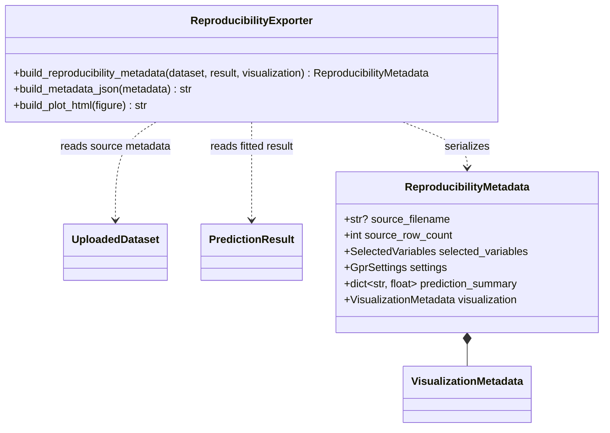
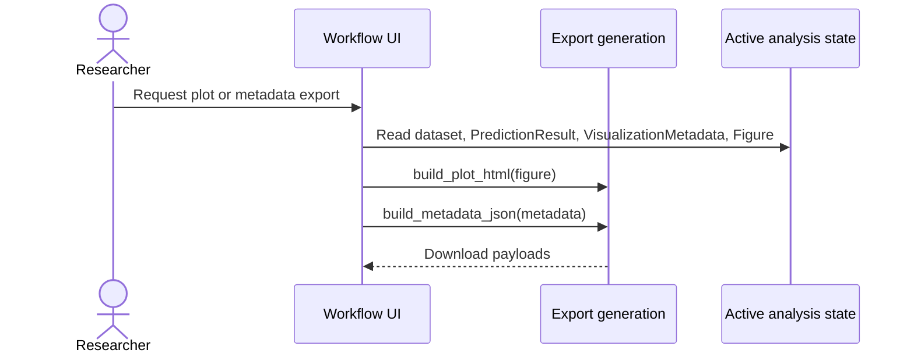

# Implementation Plan - Export Plot and Reproducibility Metadata

<!-- implementation-plan | version: 2.0 | issue: 13 | story-version: 1.0 | architecture-version: 1.0 | repository-revision: 2fb7e5d -->

## Scope and Lineage

- Repository issue: `#13` - `US-0007 - Export Plot and Reproducibility Metadata`
- Planning batch: `batch-002`
- Reconciliation batch, when applicable: `registry-repair-001`
- Source stories: `US-0007`
- Technical review: `TR-002`
- Architecture document: `sdlc_docs/02_architecture/00_architecture_document.md`
- Relevant arc42 concerns: Sections 5, 6, 8, 10
- Software system: Gaussian Process Regression Web Application
- Container or data store: Streamlit Web Application; In-memory Analysis Session
- Component or data model: Prediction and uncertainty visualization; Export generation; Active analysis state
- Runtime or deployment concern: Plot and metadata export after visualization
- Related architecture decisions: ADR-001, ADR-002
- Mapping status: proposed

## Coordination

- Suggested wave: 5
- Upstream dependencies: `#12`, `#16`
- Downstream dependents: none
- Parallel-safe with: none until visualization metadata exists
- Assignment notes: This is a vertical slice: metadata JSON, plot HTML export, download controls, and tests.
- Kanban status: Ready after visualization

## Architecture Constraints to Preserve

Generate artifacts on demand from active session state. Do not add server-side saved sessions or export history.

## Current Implementation Context

`batch-002` chooses Plotly for visualization. Export module is introduced by `#14`.

## Proposed Code-Level Design

- Extend `src/gaussian_explorer/export.py`.
- Implement `build_reproducibility_metadata(dataset, prediction_result, visualization_metadata) -> ReproducibilityMetadata`.
- Implement `build_metadata_json(metadata) -> str` with deterministic sorted keys.
- Implement `build_plot_html(figure) -> str` using Plotly HTML serialization.
- Extend `app.py` with two downloads after visualization exists: `prediction_plot.html` and `reproducibility_metadata.json`.
- Metadata fields: source filename, source row count, selected X/Y columns, model settings, prediction summary, visualization labels/traces, dependency-free timestamp omitted for deterministic tests.

## Code-Level UML Diagrams

### UML Class Diagram

### UML Sequence Diagram

### Diagram Mapping

| Diagram | Notation | Architecture element | arc42 concern | Boundary check |
|---|---|---|---|---|
| UML class diagram | `classDiagram` | Export generation; Prediction visualization; Active analysis state | Sections 5, 8, 10 | Generated artifacts only, no persistence. |
| UML sequence diagram | `sequenceDiagram` | Plot and metadata export after visualization | Sections 5, 6 | Browser downloads from active state. |

### Files and Structures

| Path | Action | Purpose | Architecture element | arc42 concern |
|---|---|---|---|---|
| `src/gaussian_explorer/export.py` | Modify | Add plot HTML and metadata JSON exports. | Export generation | Sections 5, 6, 8 |
| `src/gaussian_explorer/app.py` | Modify | Add plot and metadata download controls. | Workflow UI | Sections 5, 6 |
| `tests/unit/test_export.py` | Modify | Verify metadata schema and plot HTML payload. | Export generation | Sections 8, 10 |
| `tests/integration/test_app_workflow.py` | Modify | Verify downloads appear after visualization. | Workflow UI | Sections 6, 8 |

## Implementation Increments

### Increment 1 - Reproducibility Metadata JSON

- Architecture element: Export generation; Active analysis state
- arc42 concern: Sections 5, 8, 10
- Affected files: `src/gaussian_explorer/export.py`, `tests/unit/test_export.py`
- Developer tests: metadata includes source filename, source row count, selected variables, settings, prediction summary, and visualization metadata with deterministic JSON order.
- Implementation change: add metadata dataclass/dict builder and JSON serializer.
- Verification: `uv run pytest tests/unit/test_export.py`
- Dependencies: `#12`, `#16`
- Completion condition: fitted analysis can produce reproducibility metadata.

### Increment 2 - Plot HTML Export

- Architecture element: Export generation; Prediction visualization
- arc42 concern: Sections 5, 6, 8, 10
- Affected files: `src/gaussian_explorer/export.py`, `tests/unit/test_export.py`
- Developer tests: Plotly figure serializes to non-empty HTML containing expected trace names.
- Implementation change: add `build_plot_html`.
- Verification: `uv run pytest tests/unit/test_export.py`
- Dependencies: `#16`
- Completion condition: visualization can be exported as a plot artifact.

### Increment 3 - Streamlit Plot and Metadata Downloads

- Architecture element: Workflow UI; Active analysis state
- arc42 concern: Sections 5, 6, 8
- Affected files: `src/gaussian_explorer/app.py`, `tests/integration/test_app_workflow.py`
- Developer tests: plot and metadata downloads are absent before visualization and present afterward.
- Implementation change: add `st.download_button` controls for `prediction_plot.html` and `reproducibility_metadata.json`.
- Verification: `uv run pytest tests/integration/test_app_workflow.py`
- Dependencies: Increments 1 and 2
- Completion condition: researcher can export plot and reproducibility metadata after viewing results.

## Data, Configuration, Migration, and Recovery

No migration, secrets, or persistence. Metadata is deterministic for reproducibility and tests.

## Quality and Operational Verification

Unit tests assert metadata keys and payload content; integration tests assert download availability.

## Risks, Dependencies, and Open Questions

HTML plot export satisfies approved "plot output" without adding static image system dependencies. A mandatory PNG/PDF format requires product clarification.

## Routes to Upstream Skills

Additional export formats or saved analysis records route upstream.

## Readiness

- Assessment: `ready`
- Approver, when required: pending
- Date: `2026-07-16`
