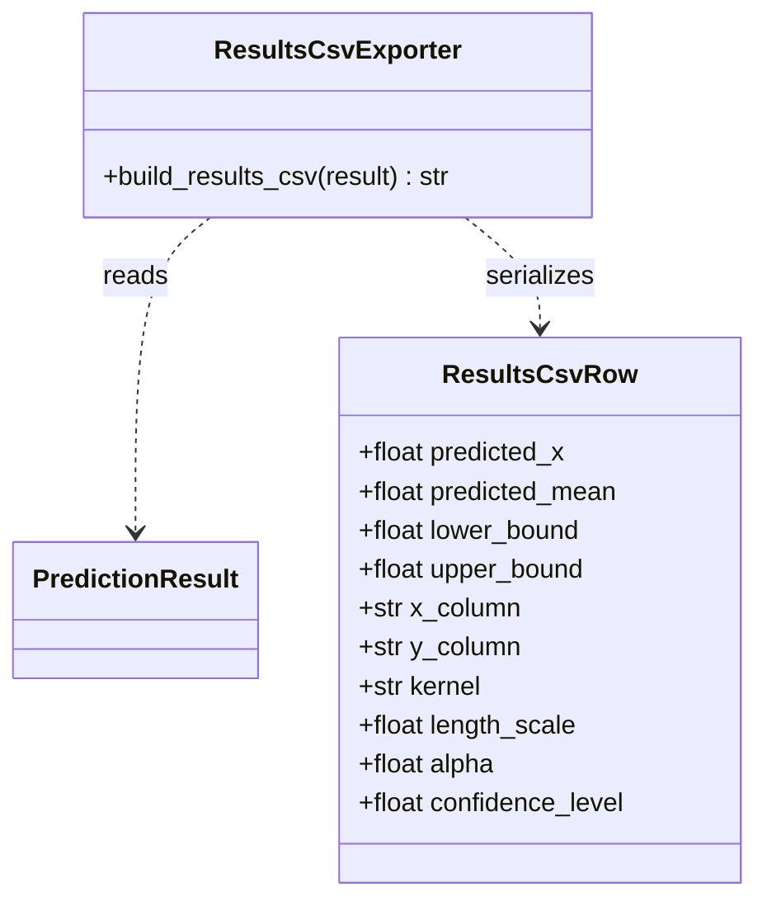
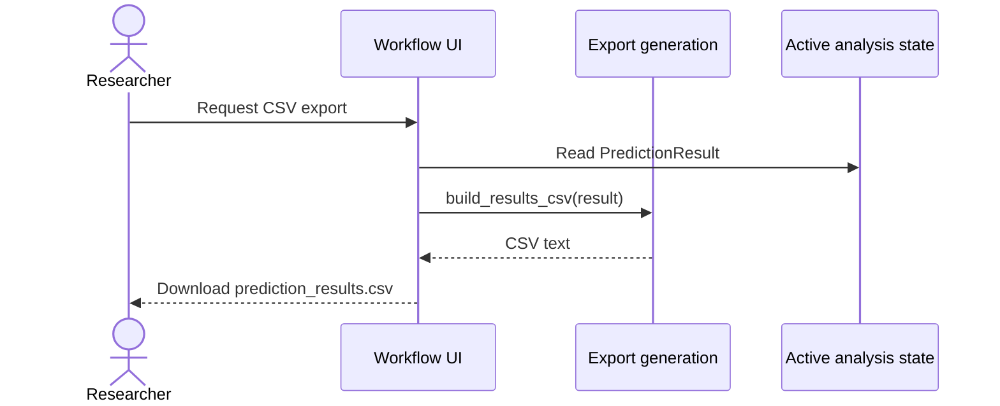

# Implementation Plan - Export Tabular Prediction Results

<!-- implementation-plan | version: 2.0 | issue: 14 | story-version: 1.0 | architecture-version: 1.0 | repository-revision: 2fb7e5d -->

## Scope and Lineage

- Repository issue: `#14` - `US-0006 - Export Tabular Prediction Results`
- Planning batch: `batch-002`
- Reconciliation batch, when applicable: `registry-repair-001`
- Source stories: `US-0006`
- Technical review: `TR-002`
- Architecture document: `sdlc_docs/02_architecture/00_architecture_document.md`
- Relevant arc42 concerns: Sections 5, 6, 8, 10
- Software system: Gaussian Process Regression Web Application
- Container or data store: Streamlit Web Application; In-memory Analysis Session
- Component or data model: Export generation; GPR fitting and prediction; Variable and GPR settings; Active analysis state
- Runtime or deployment concern: Export download after fitting
- Related architecture decisions: ADR-001, ADR-002
- Mapping status: proposed

## Coordination

- Suggested wave: 4
- Upstream dependencies: `#12`
- Downstream dependents: none
- Parallel-safe with: `#16`
- Assignment notes: This is a vertical slice: deterministic CSV schema, download button, and tests.
- Kanban status: Ready after `PredictionResult`

## Architecture Constraints to Preserve

Exports are generated on demand from active fitted state. Do not add server-side export history or saved sessions.

## Current Implementation Context

No export module exists.

## Proposed Code-Level Design

- Create `src/gaussian_explorer/export.py`.
- Implement `build_results_csv(prediction_result) -> str`.
- Use exact CSV columns: `predicted_x`, `predicted_mean`, `lower_bound`, `upper_bound`, `x_column`, `y_column`, `kernel`, `length_scale`, `alpha`, `prediction_min`, `prediction_max`, `prediction_points`, `confidence_level`.
- Repeat selected variable and setting metadata on each prediction row to keep the file rectangular and CSV-tool friendly.
- Extend `app.py` with `st.download_button` for `prediction_results.csv` after fitting.

## Code-Level UML Diagrams

### UML Class Diagram

### UML Sequence Diagram

### Diagram Mapping

| Diagram | Notation | Architecture element | arc42 concern | Boundary check |
|---|---|---|---|---|
| UML class diagram | `classDiagram` | Export generation; Active analysis state | Sections 5, 8, 10 | CSV from active result only. |
| UML sequence diagram | `sequenceDiagram` | Export download after fitting | Sections 5, 6 | Browser download, no persistence. |

### Files and Structures

| Path | Action | Purpose | Architecture element | arc42 concern |
|---|---|---|---|---|
| `src/gaussian_explorer/export.py` | Create | Generate results CSV. | Export generation | Sections 5, 6, 8 |
| `src/gaussian_explorer/app.py` | Modify | Add CSV download button after fit. | Workflow UI | Sections 5, 6 |
| `tests/unit/test_export.py` | Create | Verify CSV schema, rows, and settings metadata. | Export generation | Sections 8, 10 |
| `tests/integration/test_app_workflow.py` | Modify | Verify CSV download is available only after fit. | Workflow UI | Sections 6, 8 |

## Implementation Increments

### Increment 1 - Deterministic Results CSV

- Architecture element: Export generation
- arc42 concern: Sections 5, 8, 10
- Affected files: `src/gaussian_explorer/export.py`, `tests/unit/test_export.py`
- Developer tests: CSV header exactly matches planned schema; row count equals prediction points; selected variable names and settings repeat on each row.
- Implementation change: add `build_results_csv` using Python `csv` module and deterministic field order.
- Verification: `uv run pytest tests/unit/test_export.py`
- Dependencies: `#12` result contract
- Completion condition: fitted prediction result serializes to the approved tabular export.

### Increment 2 - Streamlit CSV Download

- Architecture element: Workflow UI; Active analysis state
- arc42 concern: Sections 5, 6, 8
- Affected files: `src/gaussian_explorer/app.py`, `tests/integration/test_app_workflow.py`
- Developer tests: CSV download button is absent before fit and present after fit.
- Implementation change: add `st.download_button` for `prediction_results.csv`.
- Verification: `uv run pytest tests/integration/test_app_workflow.py`
- Dependencies: Increment 1
- Completion condition: researcher can export tabular prediction results after fitting.

## Data, Configuration, Migration, and Recovery

No migration or secrets. Export payload is generated on demand from active `prediction_result`.

## Quality and Operational Verification

Unit tests verify exact CSV schema to avoid downstream ambiguity.

## Risks, Dependencies, and Open Questions

If product later wants a separate metadata header or multi-file export, route to story review.

## Routes to Upstream Skills

Additional export formats or saved export history route upstream.

## Readiness

- Assessment: `ready`
- Approver, when required: pending
- Date: `2026-07-16`
