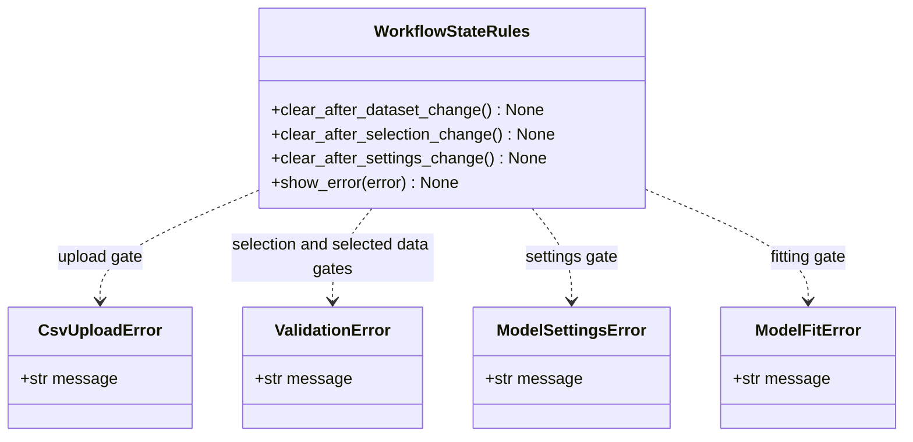
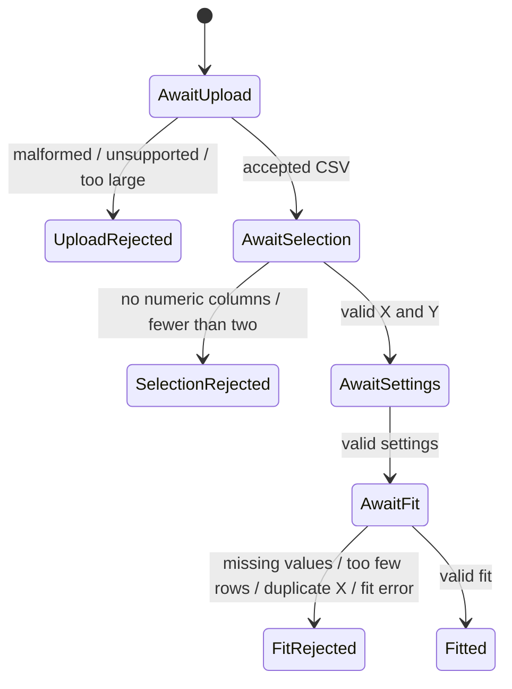

# Implementation Plan - Receive Clear Invalid-Input Feedback

<!-- implementation-plan | version: 2.0 | issue: 15 | story-version: 1.0 | architecture-version: 1.0 | repository-revision: 2fb7e5d -->

## Scope and Lineage

- Repository issue: `#15` - `US-0008 - Receive Clear Invalid-Input Feedback`
- Planning batch: `batch-002`
- Reconciliation batch, when applicable: `registry-repair-001`
- Source stories: `US-0008`
- Technical review: `TR-002`
- Architecture document: `sdlc_docs/02_architecture/00_architecture_document.md`
- Relevant arc42 concerns: Sections 3, 5, 6, 8, 10
- Software system: Gaussian Process Regression Web Application
- Container or data store: Streamlit Web Application; In-memory Analysis Session
- Component or data model: Workflow UI; CSV parsing and validation; Variable and GPR settings; GPR fitting and prediction; Active analysis state
- Runtime or deployment concern: Upload, selection, and fitting validation gates
- Related architecture decisions: ADR-001, ADR-002
- Mapping status: confirmed / proposed

## Coordination

- Suggested wave: split across waves 1, 2, and 3
- Upstream dependencies: `#9`, `#10`, `#12`
- Downstream dependents: release validation
- Parallel-safe with: coordinated slices of `#9`, `#10`, and `#12`
- Assignment notes: This is a cross-cutting vertical plan. Implement each increment alongside its owning workflow gate.
- Kanban status: Ready

## Architecture Constraints to Preserve

Invalid data must not advance downstream session state. Do not add persistent error logs or external validation services.

## Current Implementation Context

`CsvUploadError` exists. No shared validation module, selected-data validation, or Streamlit error mapping exists.

## Proposed Code-Level Design

- Use existing `CsvUploadError` for upload failures.
- Add `ValidationError` in `src/gaussian_explorer/validation.py`.
- Add `ModelSettingsError` and `ModelFitError` in `src/gaussian_explorer/model.py`.
- Add selected-data validation: no missing selected values, at least `MIN_FIT_ROWS = 3`, and no duplicate X values.
- `app.py` catches domain exceptions and displays corrective messages with `st.error`.
- Changing dataset, selection, or settings clears downstream stale state.

## Code-Level UML Diagrams

### UML Class Diagram

### UML State Machine Diagram

### Diagram Mapping

| Diagram | Notation | Architecture element | arc42 concern | Boundary check |
|---|---|---|---|---|
| UML class diagram | `classDiagram` | Workflow UI; validation components | Sections 5, 8, 10 | Domain errors become UI feedback without persistence. |
| UML state machine diagram | `stateDiagram-v2` | Upload, selection, and fitting validation gates | Sections 3, 5, 6, 8, 10 | Invalid states cannot advance downstream. |

### Files and Structures

| Path | Action | Purpose | Architecture element | arc42 concern |
|---|---|---|---|---|
| `src/gaussian_explorer/data.py` | Modify | Upload invalid-input messages and size/type guards. | CSV parsing and validation | Sections 3, 5, 8 |
| `src/gaussian_explorer/validation.py` | Create/modify | Numeric availability and selected-data validation. | Variable and GPR settings | Sections 5, 6, 8 |
| `src/gaussian_explorer/model.py` | Modify | Settings/fitting errors and safe fitting failures. | GPR fitting and prediction | Sections 5, 6, 10 |
| `src/gaussian_explorer/app.py` | Modify | Error display and stale-state clearing. | Workflow UI; Active analysis state | Sections 5, 6, 8 |
| `tests/unit/test_data.py` | Modify | Upload rejection coverage. | CSV parsing and validation | Sections 8, 10 |
| `tests/unit/test_validation.py` | Modify | Selection and selected-data rejection coverage. | Variable and GPR settings | Sections 8, 10 |
| `tests/unit/test_model_settings.py` | Modify | Settings rejection coverage. | Variable and GPR settings | Sections 8, 10 |
| `tests/unit/test_model_fitting.py` | Modify | Fitting error coverage. | GPR fitting and prediction | Sections 8, 10 |
| `tests/integration/test_app_workflow.py` | Modify | Invalid workflow gates and error display. | Workflow UI | Sections 6, 8 |

## Implementation Increments

### Increment 1 - Upload Gate Feedback

- Architecture element: CSV parsing and validation; Workflow UI
- arc42 concern: Sections 3, 5, 6, 8
- Affected files: `src/gaussian_explorer/data.py`, `src/gaussian_explorer/app.py`, `tests/unit/test_data.py`, `tests/integration/test_app_workflow.py`
- Developer tests: malformed CSV, unsupported suffix, oversized file, duplicate headers, and no data rows show clear feedback and do not store dataset.
- Implementation change: normalize upload errors and map them to Streamlit error messages.
- Verification: `uv run pytest tests/unit/test_data.py tests/integration/test_app_workflow.py`
- Dependencies: `#9`
- Completion condition: unusable uploads cannot proceed to selection.

### Increment 2 - Variable Availability and Selection Feedback

- Architecture element: Variable and GPR settings; Workflow UI
- arc42 concern: Sections 5, 6, 8
- Affected files: `src/gaussian_explorer/validation.py`, `src/gaussian_explorer/app.py`, `tests/unit/test_validation.py`, `tests/integration/test_app_workflow.py`
- Developer tests: no numeric columns, one numeric column, unknown column, and same X/Y choices are rejected clearly.
- Implementation change: add `ValidationError` and gate variable controls.
- Verification: `uv run pytest tests/unit/test_validation.py tests/integration/test_app_workflow.py`
- Dependencies: `#10`
- Completion condition: invalid variable choices cannot reach settings/fitting.

### Increment 3 - Selected-Data and Fit Feedback

- Architecture element: GPR fitting and prediction; Workflow UI
- arc42 concern: Sections 5, 6, 8, 10
- Affected files: `src/gaussian_explorer/validation.py`, `src/gaussian_explorer/model.py`, `src/gaussian_explorer/app.py`, `tests/unit/test_validation.py`, `tests/unit/test_model_fitting.py`, `tests/integration/test_app_workflow.py`
- Developer tests: missing selected values, fewer than three valid rows, duplicate X values, invalid settings, and model fit failures are rejected clearly and do not overwrite previous valid results.
- Implementation change: add selected-data validation, fitting error handling, and stale-state clearing rules.
- Verification: `uv run pytest tests/unit/test_validation.py tests/unit/test_model_fitting.py tests/integration/test_app_workflow.py`
- Dependencies: `#11`, `#12`
- Completion condition: invalid selected data cannot produce or replace prediction results.

## Data, Configuration, Migration, and Recovery

No migration or secrets. Recovery is session-local: show a corrective message and keep the user at the current valid workflow gate.

## Quality and Operational Verification

Developer tests cover every invalid-input case named in `US-0008`.

## Risks, Dependencies, and Open Questions

`MIN_FIT_ROWS = 3` and `MAX_UPLOAD_BYTES = 5_000_000` are implementation thresholds for MVP safety. User-facing threshold changes route upstream.

## Routes to Upstream Skills

New validation categories or changed acceptance behavior route to Skills B/C/D; persistence or external validation routes to Skill E.

## Readiness

- Assessment: `ready`
- Approver, when required: pending
- Date: `2026-07-16`
