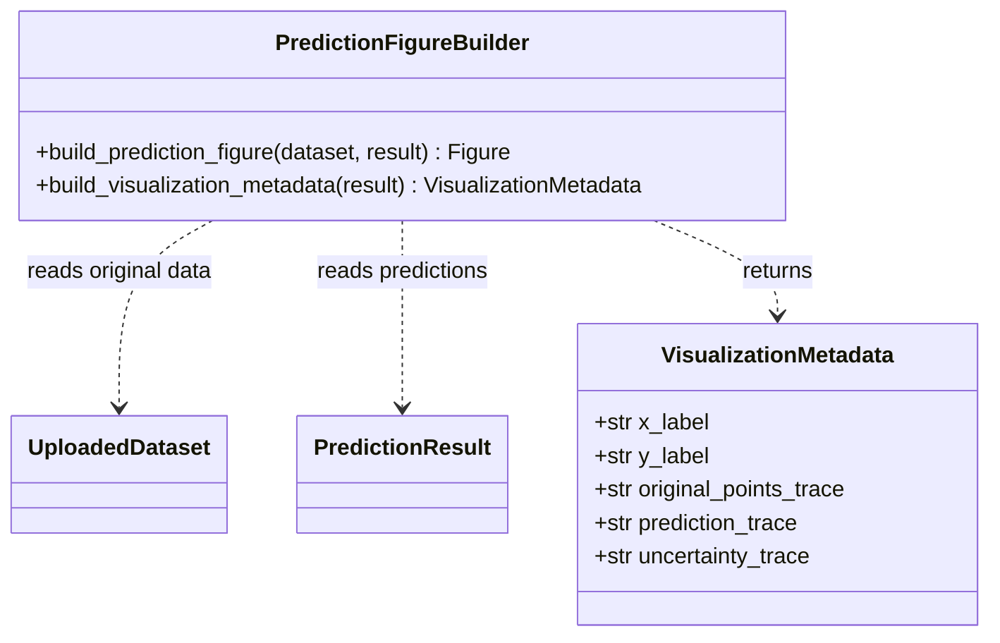
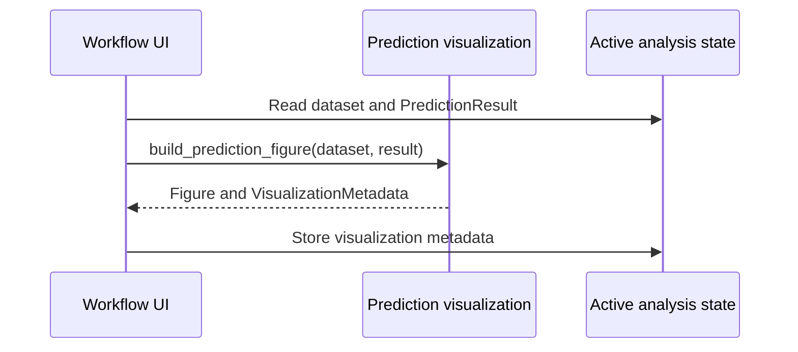

# Implementation Plan - View Prediction and Uncertainty

<!-- implementation-plan | version: 2.0 | issue: 16 | story-version: 1.0 | architecture-version: 1.0 | repository-revision: 2fb7e5d -->

## Scope and Lineage

- Repository issue: `#16` - `US-0005 - View Prediction and Uncertainty`
- Planning batch: `batch-002`
- Reconciliation batch, when applicable: `registry-repair-001`
- Source stories: `US-0005`
- Technical review: `TR-002`
- Architecture document: `sdlc_docs/02_architecture/00_architecture_document.md`
- Relevant arc42 concerns: Sections 5, 6, 8, 10
- Software system: Gaussian Process Regression Web Application
- Container or data store: Streamlit Web Application; In-memory Analysis Session
- Component or data model: Prediction and uncertainty visualization; GPR fitting and prediction; Active analysis state
- Runtime or deployment concern: Result visualization after fitting
- Related architecture decisions: ADR-001, ADR-002
- Mapping status: proposed

## Coordination

- Suggested wave: 4
- Upstream dependencies: `#12`
- Downstream dependents: `#13`
- Parallel-safe with: `#14`
- Assignment notes: This is a vertical slice: Plotly dependency, figure builder, UI rendering, metadata, and tests.
- Kanban status: Ready after `PredictionResult`

## Architecture Constraints to Preserve

Visualization reads fitted in-memory state and does not refit the model or persist artifacts.

## Current Implementation Context

No visualization module exists. `pyproject.toml` does not declare a plotting library.

## Proposed Code-Level Design

- Add runtime dependency: `plotly`.
- Create `src/gaussian_explorer/visualization.py`.
- Add `VisualizationMetadata` with x/y labels and trace names.
- Implement `build_prediction_figure(dataset, prediction_result) -> plotly.graph_objects.Figure`.
- Figure contains original data points, predicted mean line, and uncertainty band.
- Extend `app.py` to render the figure using `st.plotly_chart` after `prediction_result` exists.
- Store `st.session_state["visualization_metadata"]` for `#13`.

## Code-Level UML Diagrams

### UML Class Diagram

### UML Sequence Diagram

### Diagram Mapping

| Diagram | Notation | Architecture element | arc42 concern | Boundary check |
|---|---|---|---|---|
| UML class diagram | `classDiagram` | Prediction and uncertainty visualization | Sections 5, 8, 10 | Reads fitted state only. |
| UML sequence diagram | `sequenceDiagram` | Result visualization after fitting | Sections 5, 6 | No persistence or refit. |

### Files and Structures

| Path | Action | Purpose | Architecture element | arc42 concern |
|---|---|---|---|---|
| `pyproject.toml` | Modify | Add `plotly`. | Prediction visualization | Sections 2, 5 |
| `src/gaussian_explorer/visualization.py` | Create | Build figure and metadata. | Prediction and uncertainty visualization | Sections 5, 6, 10 |
| `src/gaussian_explorer/app.py` | Modify | Render plot after fitting. | Workflow UI; Active analysis state | Sections 5, 6 |
| `tests/unit/test_visualization.py` | Create | Test traces and metadata. | Prediction visualization | Sections 8, 10 |
| `tests/integration/test_app_workflow.py` | Modify | Verify plot appears after fit. | Workflow UI | Sections 6, 8 |

## Implementation Increments

### Increment 1 - Build Plotly Figure and Metadata

- Architecture element: Prediction and uncertainty visualization
- arc42 concern: Sections 5, 8, 10
- Affected files: `pyproject.toml`, `src/gaussian_explorer/visualization.py`, `tests/unit/test_visualization.py`
- Developer tests: figure includes original points, predicted mean, uncertainty band, and axis labels from selected variables.
- Implementation change: add Plotly figure builder and `VisualizationMetadata`.
- Verification: `uv run pytest tests/unit/test_visualization.py`
- Dependencies: `#12` result contract
- Completion condition: prediction result can be transformed into a displayable figure.

### Increment 2 - Render Visualization in Streamlit

- Architecture element: Workflow UI; Active analysis state
- arc42 concern: Sections 5, 6, 8
- Affected files: `src/gaussian_explorer/app.py`, `tests/integration/test_app_workflow.py`
- Developer tests: plot renders only after fitting and metadata is stored for export.
- Implementation change: call `st.plotly_chart` with generated figure and store metadata.
- Verification: `uv run pytest tests/integration/test_app_workflow.py`
- Dependencies: Increment 1
- Completion condition: researcher can view original data, predicted curve, and uncertainty together.

## Data, Configuration, Migration, and Recovery

No migration or secrets. Visualization state is regenerated from active fitted state.

## Quality and Operational Verification

Tests assert trace names and data series rather than pixel output.

## Risks, Dependencies, and Open Questions

Plotly is an implementation choice inside approved architecture. A mandatory non-HTML/static image requirement would route upstream.

## Routes to Upstream Skills

Additional visualization types or persistent plot history route upstream.

## Readiness

- Assessment: `ready`
- Approver, when required: pending
- Date: `2026-07-16`
