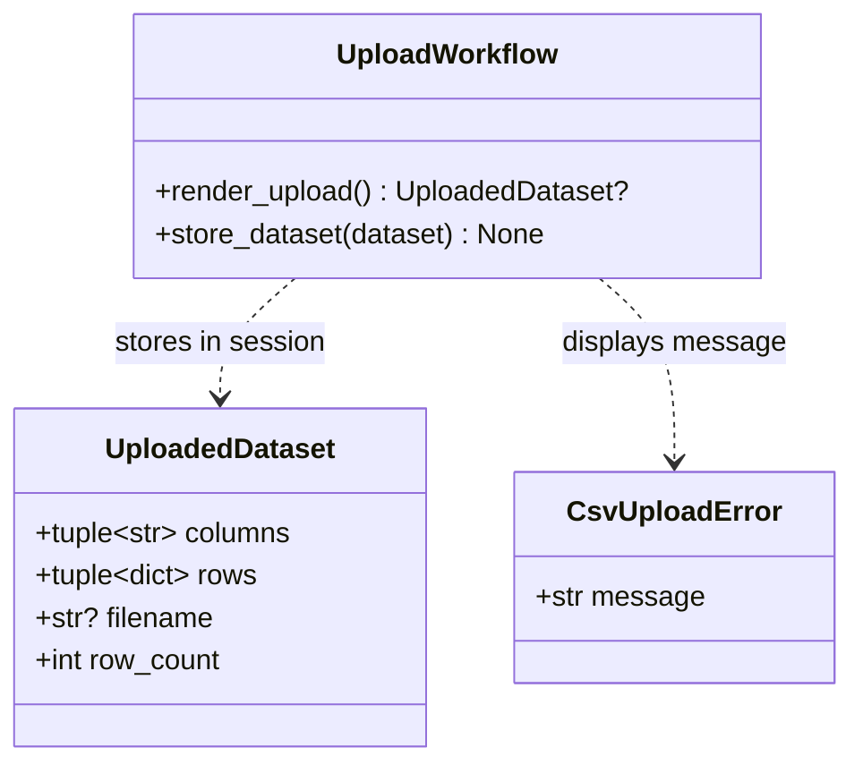
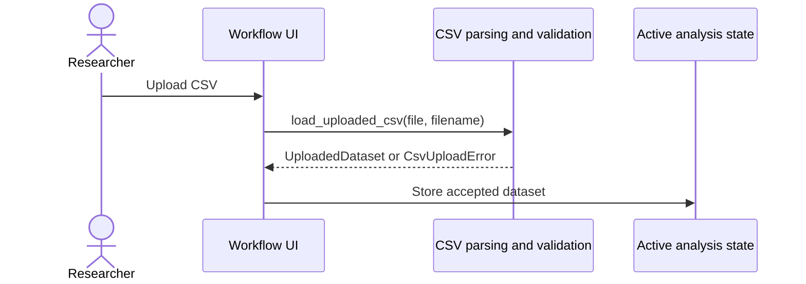

# Implementation Plan - Upload Experimental CSV Data

<!-- implementation-plan | version: 2.0 | issue: 9 | story-version: 1.0 | architecture-version: 1.0 | repository-revision: 2fb7e5d -->

## Scope and Lineage

- Repository issue: `#9` - `US-0001 - Upload Experimental CSV Data`
- Planning batch: `batch-002`
- Reconciliation batch, when applicable: `registry-repair-001`
- Source stories: `US-0001`
- Technical review: `TR-002`
- Architecture document: `sdlc_docs/02_architecture/00_architecture_document.md`
- Relevant arc42 concerns: Sections 3, 5, 6, 8
- Software system: Gaussian Process Regression Web Application
- Container or data store: Streamlit Web Application; In-memory Analysis Session
- Component or data model: Workflow UI; CSV parsing and validation; Active analysis state
- Runtime or deployment concern: CSV upload gate
- Related architecture decisions: ADR-001, ADR-002
- Mapping status: confirmed / proposed

## Coordination

- Suggested wave: 1
- Upstream dependencies: none
- Downstream dependents: `#10`, `#12`, `#15`
- Parallel-safe with: upload-validation slice of `#15`
- Assignment notes: This is a vertical slice: parser, upload UI, session state, and tests.
- Kanban status: Ready

## Architecture Constraints to Preserve

Keep uploaded data in memory only. Do not add persistence, external parsing services, user accounts, or background processing.

## Current Implementation Context

`src/gaussian_explorer/data.py` already contains `UploadedDataset`, `CsvUploadError`, and `load_uploaded_csv`. `tests/unit/test_data.py` covers basic loading and duplicate/no-row rejection. No Streamlit app entry point exists.

## Proposed Code-Level Design

- Use `src/gaussian_explorer/data.py` for CSV parsing and file-level validation.
- Create `src/gaussian_explorer/app.py` as the Streamlit entry point.
- Store accepted datasets in `st.session_state["dataset"]`.
- Add implementation constants: `SUPPORTED_UPLOAD_SUFFIXES = (".csv",)` and `MAX_UPLOAD_BYTES = 5_000_000`.
- Reject unsupported suffix, oversized measurable uploads, missing headers, duplicate headers, and no data rows through `CsvUploadError`.

## Code-Level UML Diagrams

### UML Class Diagram

### UML Sequence Diagram

### Diagram Mapping

| Diagram | Notation | Architecture element | arc42 concern | Boundary check |
|---|---|---|---|---|
| UML class diagram | `classDiagram` | CSV parsing and validation; Workflow UI; Active analysis state | Sections 5, 8 | In-memory dataset only. |
| UML sequence diagram | `sequenceDiagram` | CSV upload gate | Sections 3, 6 | Browser upload to Streamlit session state only. |

### Files and Structures

| Path | Action | Purpose | Architecture element | arc42 concern |
|---|---|---|---|---|
| `src/gaussian_explorer/data.py` | Modify | Add suffix/size validation constants and stable upload errors. | CSV parsing and validation | Sections 3, 5, 8 |
| `src/gaussian_explorer/app.py` | Create | Streamlit upload UI and dataset session-state storage. | Workflow UI; Active analysis state | Sections 3, 5, 6 |
| `tests/unit/test_data.py` | Modify | Cover file-level validation and accepted dataset contract. | CSV parsing and validation | Sections 8, 10 |
| `tests/integration/test_app_workflow.py` | Create | Verify upload workflow state using Streamlit test support where practical. | Workflow UI | Sections 6, 8 |

## Implementation Increments

### Increment 1 - Strengthen CSV Parser Contract

- Architecture element: CSV parsing and validation
- arc42 concern: Sections 3, 5, 8
- Affected files: `src/gaussian_explorer/data.py`, `tests/unit/test_data.py`
- Developer tests: supported CSV accepted; duplicate headers, missing headers, no rows, unsupported suffix, and oversized bytes rejected.
- Implementation change: add `SUPPORTED_UPLOAD_SUFFIXES`, `MAX_UPLOAD_BYTES`, suffix/size checks, and stable error messages.
- Verification: `uv run pytest tests/unit/test_data.py`
- Dependencies: none
- Completion condition: `load_uploaded_csv` returns a complete `UploadedDataset` or raises `CsvUploadError`.

### Increment 2 - Add Streamlit Upload Gate

- Architecture element: Workflow UI; Active analysis state
- arc42 concern: Sections 3, 5, 6, 8
- Affected files: `src/gaussian_explorer/app.py`, `tests/integration/test_app_workflow.py`
- Developer tests: upload control accepts supported CSV and stores `dataset`; rejected uploads show a message and do not store dataset.
- Implementation change: add `st.file_uploader`, call `load_uploaded_csv`, and store accepted data in `st.session_state`.
- Verification: `uv run pytest tests/integration/test_app_workflow.py`
- Dependencies: Increment 1
- Completion condition: a researcher can upload a supported CSV and downstream variable selection can read the dataset.

## Data, Configuration, Migration, and Recovery

No migration, secrets, or external configuration. Rejected uploads leave prior valid dataset state unchanged unless the user uploads a new valid file.

## Quality and Operational Verification

Unit and integration tests cover accepted and rejected upload behavior. Manual Streamlit smoke check may be added before release validation.

## Risks, Dependencies, and Open Questions

`MAX_UPLOAD_BYTES = 5_000_000` is an MVP implementation threshold. Product changes to this threshold route upstream only if user-facing expectations change.

## Routes to Upstream Skills

Additional file types, persistent uploads, or external storage route to Skills B/C/D and E.

## Readiness

- Assessment: `ready`
- Approver, when required: pending
- Date: `2026-07-16`
